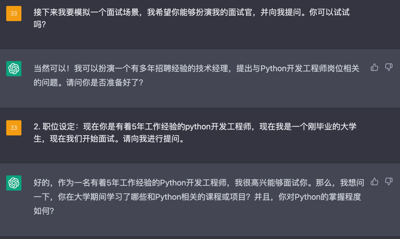
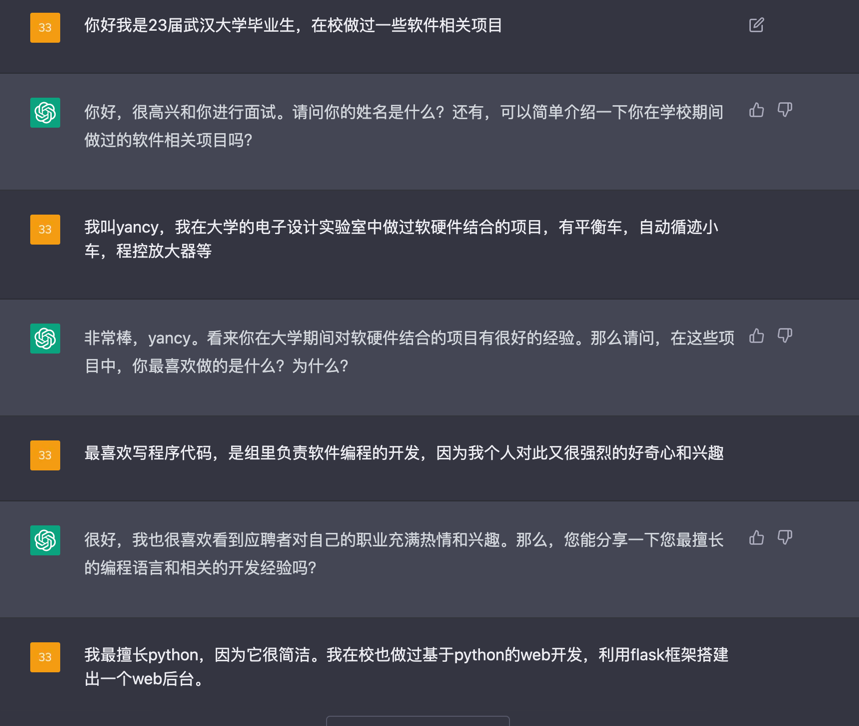
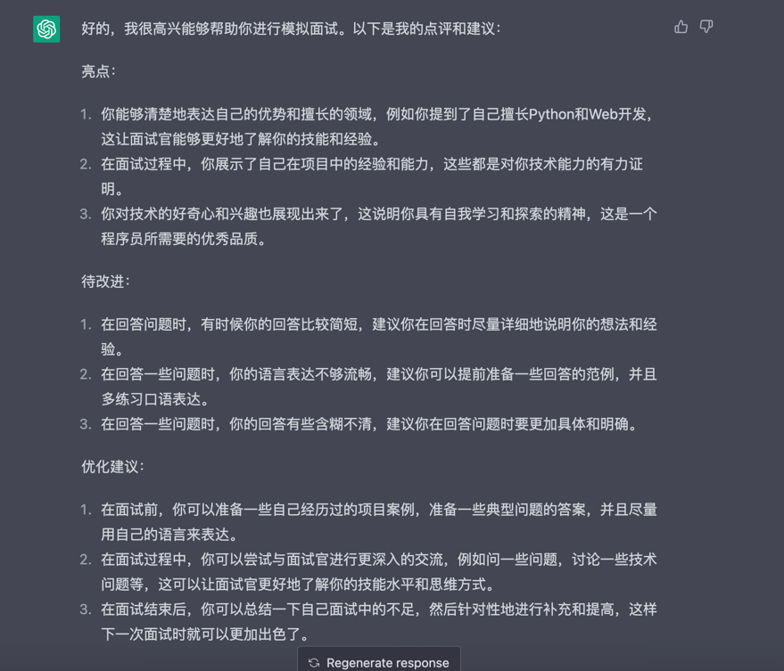
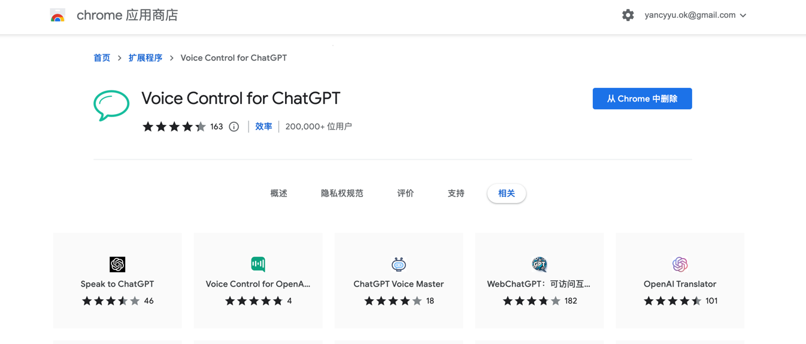
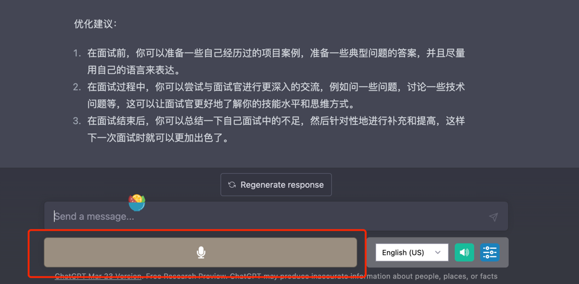
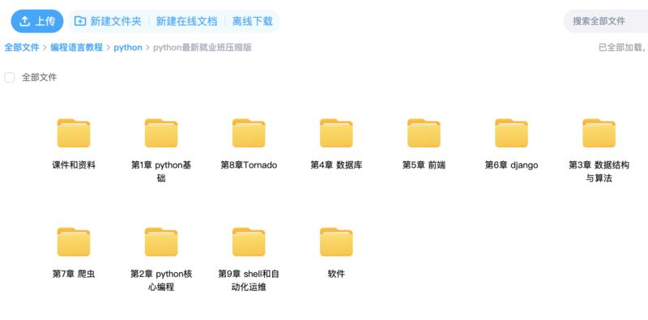
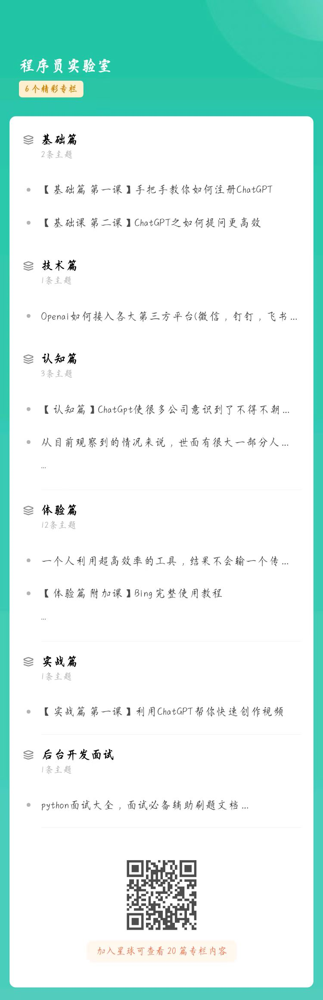
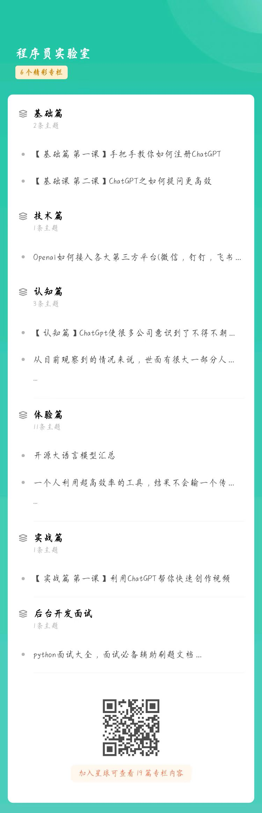

今天这篇文章将对刚刚毕业的大学生或行业新人提供有力帮助。我们将向您展示如何让ChatGPT成为您的万能面试官，不仅支持初、中、高级各种职位的面试，还可以对您的表现进行全方位复盘。

请注意，我们之前的教程已经展示了ChatGPT在角色扮演方面的稳定表现。

我们先来拆解一下面试官需要用到ChatGPT的哪些能力

- 搭建人设
- 面试开始
- 面试复盘
- 让面试再真一点
- 一些扩展
- 搭建人设

还是前一篇文章中我讲过的调教手段，将接下来对话的背景、角色分配先告知ChatGPT，比如今天的主题：面试官！

#### 我们可以这么设定：

1. 角色设定：接下来我要模拟一个面试场景，我希望你能够扮演我的面试官，并向我提问。你可以试试吗？

2. 职位设定：现在你是有着5年工作经验的python开发工程师，现在我是一个刚毕业的大学生，现在我们开始面试。请向我进行提问。

让我们看看ChatGPT的表现：

#### 面试开始

在本节课中，我将向刚毕业的大学生或行业新人介绍一些操作，通过这些操作，你可以让ChatGPT成为一个万能面试官，支持初、中、高级各种职位的面试，并全方位复盘你的面试表现。

请注意，当你与ChatGPT进行角色扮演时，要认真配合，这样才能得到真实的面试反馈。

为了演示这个操作，我将模拟一场电子信息工程专业大学生的面试。

作为具有3年软件开发经验的面试官，ChatGPT的提问仍然是有一定套路的。如果你最近也在准备面试，不妨按照这个设定方式，来练习你的面试技巧。

> 你可以根据自己从事的行业设定ChatGPT的角色，并灵活调整它的工作年限、经验等级等信息。你提供的信息越详细，面试还原度就会越高。

#### 面试复盘
接下来是面试复盘的功能，这个功能非常强大。ChatGPT可以对你的面试表现进行全面的复盘。这对缺乏面试经验的人来说非常有用。

以下是ChatGPT对我的面试表现进行的复盘。如果你仔细看了我和它的对话，就能感受到这个复盘非常精准。

复盘话术：面试到此结束，请对我前面的面试过程进行点评，从亮点和待改进的角度分别提出3个点，并给我一些优化建议。

#### 让面试再真实一点

1. 找一个安静的地方，最好是独立的房间，例如书房，关闭门，打开电脑准备面试。

2. 打开谷歌浏览器，并安装浏览器插件：Voice Control for ChatGPT。

下载地址：https://chrome.google.com/webstore/detail/voice-control-for-chatgpt/eollffkcakegifhacjnlnegohfdlidhn?hl=zh-CN

3. 装好后，直接登录ChatGPT官网即可，你会发现网页下面多了麦克风按钮，说明已经成功。

4、重复上文面试步骤，这样你就可以在安静的房间内，和你的私人面试官进行语音对话了。

#### 扩展
基于上文逻辑，ChatGPT的角色适用于任何资讯类角色。除面试官外，还可以是英语私教、法律顾问、房产顾问、家庭教师、育儿专家等等任何咨询类角色。

逻辑大体都是相通的，基于类似的设定，可完美协助我们完成很多事情。

#### 变现思路

利用ChatGpt强大的文本输出能力：
1. 同声传译，教学
talki 是一个在线语言学习平台，它提供语言学习者与来自世界各地的教师进行语言学习的机会。在 italki 上，语言学习者可以选择自己感兴趣的语言、教学风格和教师，并进行一对一的在线语言学习课程。同时，italki 还提供了社交功能，使学习者能够与来自不同文化背景的人进行语言交流，进一步提高语言水平，那么我们能否利用ChatGPT做个同声传译功能，然后去教外国人中文，从而赚到一笔钱。
2. 人设封装，服务
将人设封装成一个产品，比如可以打造个人的专属面试平台，或者生成虚拟形象创作小说等等。

后面我会在我的星球，为大家深入分享更多ChatGPT的实际应用案例的拆解，比如如何利用ChatGPT创作小说，辅助程序员工作等。

有兴趣的可以加入我的星球！

* 我们的优势是:
* 三天内可退款，不过度吹捧技术本身，不夸大技术制造恐慌去割韭菜！！！
* 全是干货，手把手教你怎么做，每天只要2毛钱，进来就送价值899元的python就业班全套课程+ChatGpt教程！
* 我们这里不仅有技术大佬，也有商业大神，带你技术层面，商业层面双突破！

资料包：

星球精品课程：

星球内部部分资料截图：

* 前10名还有超值优惠券，数量有限，加下面二维码速速领取！

### 必看

- 【程序员实验室】将提供以下服务:

   > 认知方面:普通程序员如何利用技术变现。
   > 知识技能方面:
    1. 后端开发原创知识库，海量学习资料。
    2. 关于python编程语言特性的知识分享以及前沿资讯。
    3. 编程圈最近流行的工具以及使用方法，包含但不限于ChatGPT。
  

- 🚀 不定时分享干货，有兴趣的可以关注公众号。

