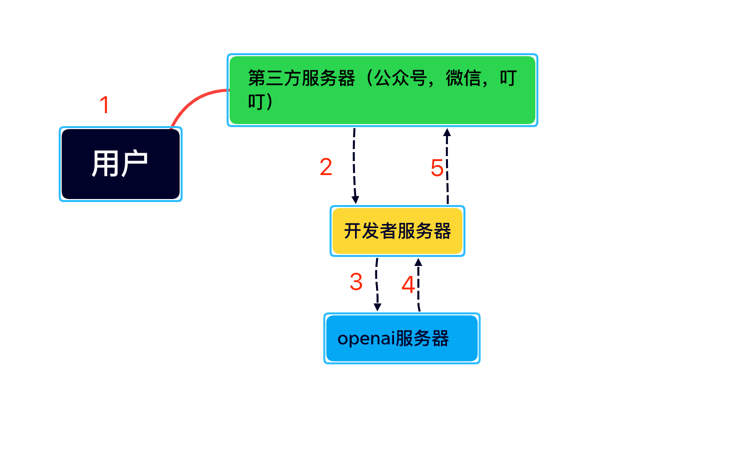
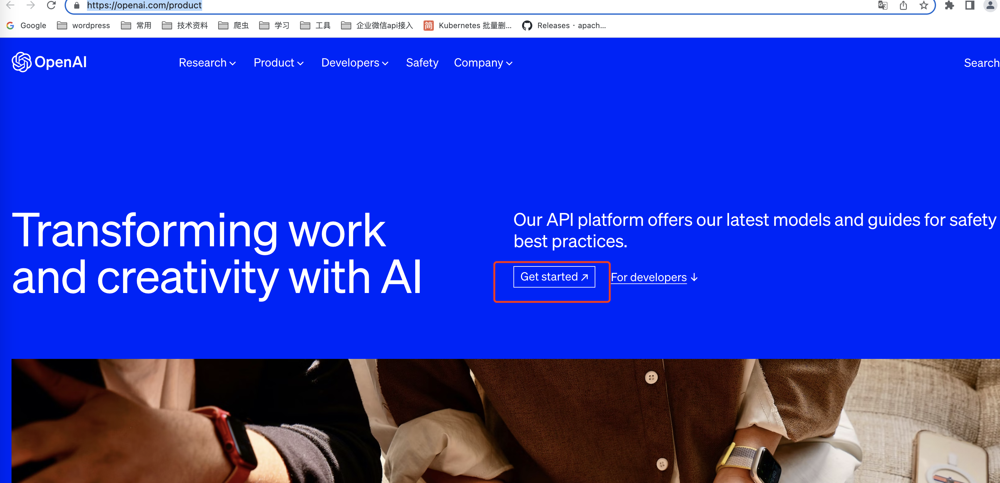
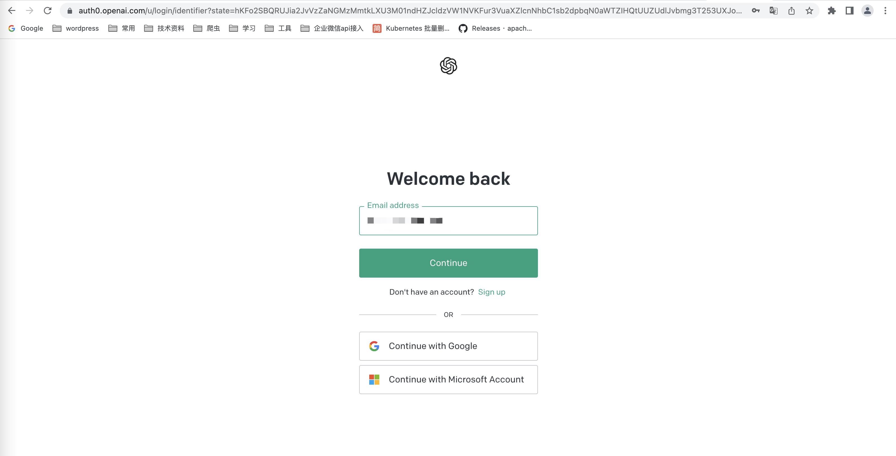
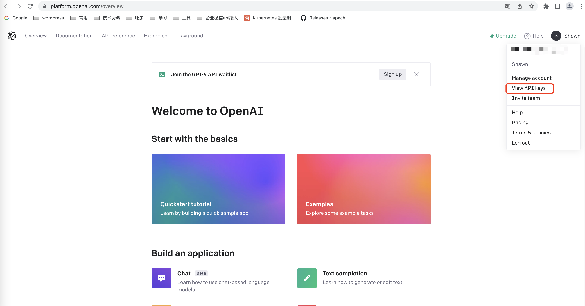
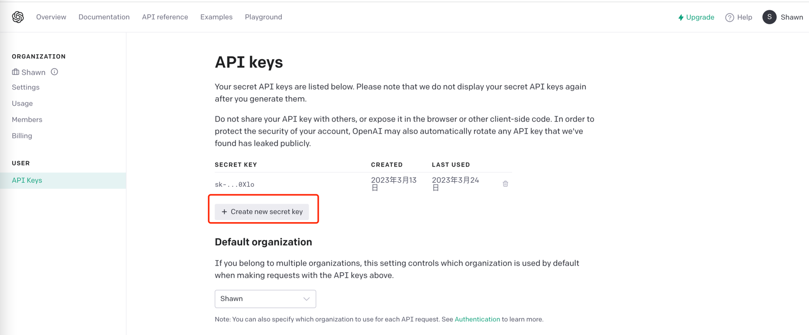
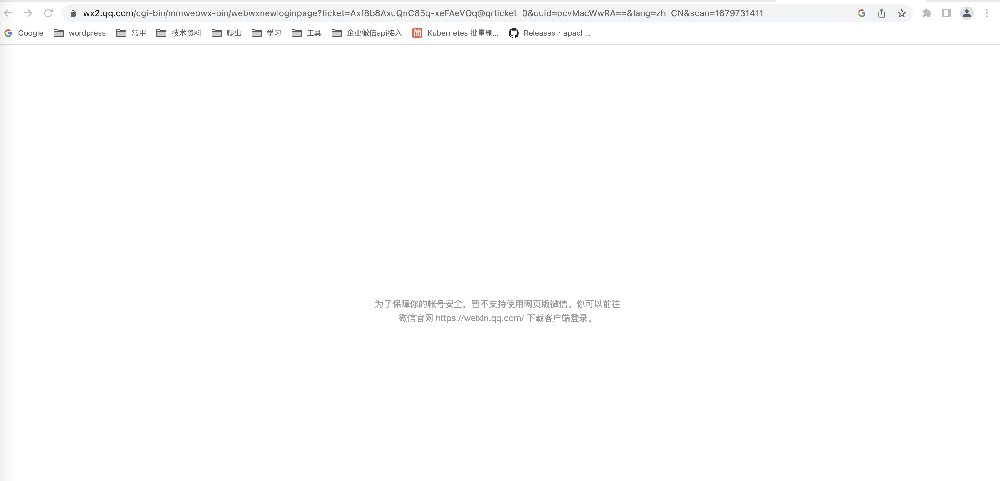

## 周主题：Openai如何接入各大第三方平台

在ChatGPT大火以后，很多人利用技术通过ChatGPT赚了自己第一桶金。

比如将ChatGPT API 接入微信，钉钉，飞书等等，由于很多人没有直接使用ChatGPT的能力，那么他们就有访问这些常用平台来调用ChatGPT需求，这可能是技术人员的一个机会！

从技术角度，所有api接入的原理其实都很简单，就是在用户和第三方交互之间嵌入一个转发服务(如下图)。

原理：请求先从用户到第三方服务器，比如微信后台服务器，然后后台会在事件被触发的时候调用开发者服务器地址，这个时候业务逻辑就会被我们接手。

**第一个必须条件：我们自己的服务端与公众号进行通信？** 

不难理解：所有第三方应用平台，比如公众号，微信，飞书等等。它们都支持与开发者服务器通信，这样来满足开发者个人或者企业的自定义化开发，这个统称为开放平台。目前，几乎所有的大应用几乎都具备这个能力，只是根据用户分配不同接口的权限，

底层原理均相同，也就是说你只要掌握了一个原理，其他的也就大同小异，无非是接口变一变，鉴权方式变一变。

> 所有的通信都需要协议，微信，公众号，飞书等等都提供了这个协议规则。只需要阅读开放平台的接入规则就可以了，我这里给大家总结了几个Github仓库如下。

**第二个必须条件：我们自己的服务器与Openai进行通信**
1. 注册ChatGpt
2. 查看API开发密钥API_KEY(st-xxxxxxxx)和组织编号（org-xxxxxxxx）查看api步骤如下：
    进入页面：https://openai.com/product
    点击Get Started按钮：
     
    进去账号登陆页面并登陆：
    
    点击头像并且查看apikey，这将是你和openai通信的必须条件
    
    没有的话就创建一个
    
    

分享接入Openai的多个项目大家择优选择，本文会持续更新～

### 1.chatGPT自制网页

这是一个，ChatGPT3.5 API 服务（即在OpenAI网页使用的模型），它允许连接多个ChatGPT账户协同工作，并构建一个对外的API接口服务

可参考python项目如下：

https://github.com/AIGCT/EASYChatGPT

https://github.com/xx025/chatgptapi_server

### 2.微信机器人（慎用）

通过 wechatpy 在微信上使用 ChatGPT，其支持在实用 OpenAI 账户，支持使用代理登录，支持与 docker 一起使用等。该工具简单易用，安装完依赖后只需要填写 OpenAI 账号密码和微信扫码即可使用。该项目的特性如下：
1. 通过 wechatpy，将 ChatGPT 接入微信
2. 创建 OpenAI 的账户池
3. 支持通过代理登陆 OpenAI
4. 加入了持续对话的功能
5. 加入 Dockerfile
6. 发布到 Docker.hub
7. 通过 Railway 进行部署
8. 实现 OpenAI 账户池的热加载
9. 当 OpenAI 返回码为 429/503 时自动重试

可参考项目：

https://github.com/wangrongding/wechat-bot
https://github.com/fuergaosi233/wechat-chatgpt

tips: wechatpy接入微信为微信网页版，稍不注意会被微信那边禁止网页登录，测试十尽量不要用微信大号。
我之前经常用微信web版本接入各种API，已经再也无法登陆。

### 3.接入飞书

实现功能：

🗣 语音交流：私人直接与机器人畅所欲言

💬 多话题对话：支持私人和群聊多话题讨论，高效连贯

🖼 文本成图：支持文本成图和以图搜图

🎭 角色扮演：支持场景模式，增添讨论乐趣和创意

🔄 上下文保留：回复对话框即可继续同一话题讨论

⏰ 自动结束：超时自动结束对话，支持清除讨论历史

📝 富文本卡片：支持富文本卡片回复，信息更丰富多彩

👍 交互式反馈：即时获取机器人处理结果

🏞 场景预设：内置丰富场景预设，方便用户管理场景 🚧

🔙 历史回档：轻松回档历史对话，继续话题讨论 🚧

🔒 管理员模式：内置管理员模式，使用更安全可靠 🚧

🌐 多token负载均衡：优化生产级别的高频调用场景

↩️ 支持反向代理：为不同地区的用户提供更快、更稳定的访问体验

📚 与飞书文档互动：成为企业员工的超级助手 🚧

🎥 话题内容秒转PPT：让你的汇报从此变得更加简单 🚧

📊 表格分析：轻松导入飞书表格，提升数据分析效率 

可参考项目：

GO语言项目：https://github.com/Leizhenpeng/feishu-chatgpt
JS插件式项目：https://github.com/bestony/ChatGPT-Feishu

### 4.接入钉钉

- 支持在钉钉群聊中添加机器人，通过@机器人进行聊天交互。
- 提问支持单聊与串聊两种模式，通过@机器人发关键字切换。
- 支持添加代理，通过配置化指定。
- 支持自定义api域名，通过配置化指定。
- 支持自定义指定的模型，通过配置化指定。
- 支持自定义默认的聊天模式，通过配置化指定。
- 支持自定义单个用户单日对话次数，通过配置化指定。

GO语言项目：https://github.com/eryajf/chatgpt-dingtalk

### 5.公众号

具有微信公众号被动回复用户消息功能的 ChatGPTBot 实现

GO语言项目：https://github.com/gtoxlili/wechat-chatGPT

### 6.其他项目

一个非官方 ChatGPT API 的 Node.js 客户端，主可以使用它来构建由 ChatGPT 支持的项目，例如聊天机器人、网站等。
https://github.com/transitive-bullshit/chatgpt-api