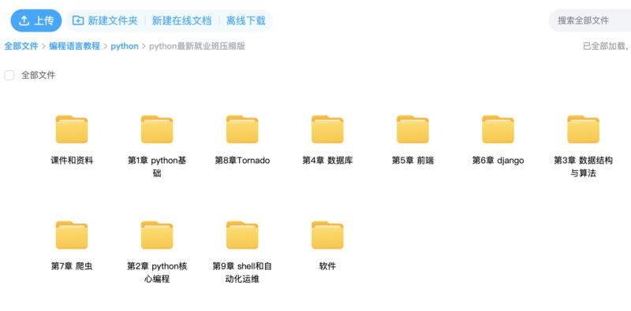

## Openai如何接入各大第三方平台

在ChatGPT大火以后，很多人利用技术通过ChatGPT赚了自己第一桶金。ChatGpt使很多公司意识到了不得不朝着数字化前进，在现在这种特殊时刻，市场上巨量的企业转型数字化。这也是技术人员变现的最好机会，短短一周，我的星球里已经有几人找我做ChatGpt接入的机器人

比如将ChatGPT API 接入微信，钉钉，飞书等等，由于很多人没有直接使用ChatGPT的能力，那么他们就有访问这些常用平台来调用ChatGPT需求。

从技术角度，所有api接入的原理其实都很简单，就是在用户和第三方交互之间嵌入一个转发服务(如下图)。

原理：请求先从用户到第三方服务器，比如微信后台服务器，然后后台会在事件被触发的时候调用开发者服务器地址，这个时候业务逻辑就会被我们接手。

**第一个必须条件：我们自己的服务端与公众号进行通信？** 

不难理解：所有第三方应用平台，比如公众号，微信，飞书等等。它们都支持与开发者服务器通信，这样来满足开发者个人或者企业的自定义化开发，这个统称为开放平台。目前，几乎所有的大应用几乎都具备这个能力，只是根据用户分配不同接口的权限，

底层原理均相同，也就是说你只要掌握了一个原理，其他的也就大同小异，无非是接口变一变，鉴权方式变一变。

**第二个必须条件：我们自己的服务器与Openai进行通信**
1. 注册ChatGpt
2. 查看API开发密钥API_KEY(st-xxxxxxxx)和组织编号（org-xxxxxxxx）查看api步骤如下：
    进入页面：https://openai.com/product
    点击Get Started按钮：
     
    进去账号登陆页面并登陆：
    
    点击头像并且查看apikey，这将是你和openai通信的必须条件
    
    没有的话就创建一个
    
    

> 所有的通信都需要协议，微信，公众号，飞书等等都提供了这个协议规则。只需要阅读开放平台的接入规则就可以了，我这里给大家总结了几个Github仓库如下。

### 1.chatGPT自制网页

这是一个，ChatGPT3.5 API 服务（即在OpenAI网页使用的模型），它允许连接多个ChatGPT账户协同工作，并构建一个对外的API接口服务

可参考python项目如下：

https://github.com/AIGCT/EASYChatGPT

https://github.com/xx025/chatgptapi_server

### 2.微信机器人（慎用）

通过 wechatpy 在微信上使用 ChatGPT，其支持在实用 OpenAI 账户，支持使用代理登录，支持与 docker 一起使用等。该工具简单易用，安装完依赖后只需要填写 OpenAI 账号密码和微信扫码即可使用。该项目的特性如下：
1. 通过 wechatpy，将 ChatGPT 接入微信
2. 创建 OpenAI 的账户池
3. 支持通过代理登陆 OpenAI
4. 加入了持续对话的功能
5. 加入 Dockerfile
6. 发布到 Docker.hub
7. 通过 Railway 进行部署
8. 实现 OpenAI 账户池的热加载
9. 当 OpenAI 返回码为 429/503 时自动重试

可参考项目：

https://github.com/wangrongding/wechat-bot
https://github.com/fuergaosi233/wechat-chatgpt

tips: wechatpy接入微信为微信网页版，稍不注意会被微信那边禁止网页登录，测试十尽量不要用微信大号。
我之前经常用微信web版本接入各种API，已经再也无法登陆。

### 3.接入飞书

实现功能：

🗣 语音交流：私人直接与机器人畅所欲言

💬 多话题对话：支持私人和群聊多话题讨论，高效连贯

🖼 文本成图：支持文本成图和以图搜图

🎭 角色扮演：支持场景模式，增添讨论乐趣和创意

🔄 上下文保留：回复对话框即可继续同一话题讨论

⏰ 自动结束：超时自动结束对话，支持清除讨论历史

📝 富文本卡片：支持富文本卡片回复，信息更丰富多彩

👍 交互式反馈：即时获取机器人处理结果

🏞 场景预设：内置丰富场景预设，方便用户管理场景 🚧

🔙 历史回档：轻松回档历史对话，继续话题讨论 🚧

🔒 管理员模式：内置管理员模式，使用更安全可靠 🚧

🌐 多token负载均衡：优化生产级别的高频调用场景

↩️ 支持反向代理：为不同地区的用户提供更快、更稳定的访问体验

📚 与飞书文档互动：成为企业员工的超级助手 🚧

🎥 话题内容秒转PPT：让你的汇报从此变得更加简单 🚧

📊 表格分析：轻松导入飞书表格，提升数据分析效率 

可参考项目：

GO语言项目：https://github.com/Leizhenpeng/feishu-chatgpt
JS插件式项目：https://github.com/bestony/ChatGPT-Feishu

### 4.接入钉钉

- 支持在钉钉群聊中添加机器人，通过@机器人进行聊天交互。
- 提问支持单聊与串聊两种模式，通过@机器人发关键字切换。
- 支持添加代理，通过配置化指定。
- 支持自定义api域名，通过配置化指定。
- 支持自定义指定的模型，通过配置化指定。
- 支持自定义默认的聊天模式，通过配置化指定。
- 支持自定义单个用户单日对话次数，通过配置化指定。

GO语言项目：https://github.com/eryajf/chatgpt-dingtalk

### 5.公众号

具有微信公众号被动回复用户消息功能的 ChatGPTBot 实现

GO语言项目：https://github.com/gtoxlili/wechat-chatGPT

### 6.其他项目

一个非官方 ChatGPT API 的 Node.js 客户端，主可以使用它来构建由 ChatGPT 支持的项目，例如聊天机器人、网站等。
https://github.com/transitive-bullshit/chatgpt-api

### 7.万能UI窗口捕捉聊天回复

这种方法可以用于各种有窗口的聊天软件，均可以自动回复。大概方法是利用python的库uiautomation（windows系统专用）
Python的uiautomation库是一个用于Windows UI自动化的Python库。该库提供了一种简单的方法，可以使用Python代码访问和控制Windows操作系统中的用户界面元素。 uiautomation库可以访问Windows应用程序，如Microsoft Office、Internet Explorer、Chrome、Firefox等等，并且可以模拟用户在应用程序中执行的操作，例如键盘输入、鼠标单击等等。同时，它还可以访问操作系统本身的用户界面元素，例如桌面、任务栏、控制面板等等。 该库可以用于测试自动化、UI自动化、Web爬虫等等应用场景。
我用uiautomation接入了一下，并成功变现，视频如下：

本文在星球持续更新，有兴趣的小伙伴可以加入我的星球【程序员实验室】，核心代码免费分享，还有海量ChatGpt学习资源等你来拿。加入就是送python就业资料包，BAT大佬亲自分享AI模型使用经验，技术小伙伴千万不要错过。

> 这段时间AI发展太快了，半个月的AI应用产品影响力已经超过了过去30年，各个大佬重新出山创业，或者加入AIGC的创业队伍。大厂之间也暗潮涌动，高级爬虫团队都被挖光了。

> 希望大家能把握到这个巨大的机会，拓宽自己的认知，提前布局，才能让自己在未来的道路上能有更多的选择。

> 我从三个方面解释一下它对于不同角色的重要性。

- 对于技术人员，我这里并不是鼓励大家都抓住这个风口去创业，因为我知道不是所有人都有试错的成本，但是市场目前是一片空白，试错陈本极低，我们即使做工具来卖工具卖服务，就可以赚到钱，有很多人只是将ChatGpt的能力封装一下，然后收费，就得到了自己的第一桶金。比如:去年靠靠买卖账号，建立自己的聊天网站并付费，靠内容输出，在内容平台，像抖音，小红书这种内容渠道大量变现。所以，行动力极其重要，要行动起来，探索它的能力边界，能赚到钱是最好的，不能赚到，至少咱们也给自己创造了新的机会。
- 对于创新型企业，更要在这个阶段去搏一搏，因为目前市场一眼望去，全是蓝海，举例子:  Chatgpt是下一代操作系统，我们所有的终端交互形式，都依赖着各种应用，移动端的各种APP,PC端的各种软件，人在被工具奴役。那能不能脱离这种限制，重新做一款连接人与人工智能操作系统这个终端的工具/硬件设备/软件，又或者你可以做一个虚拟人，为人类提供情感支持。那是不是可以就有了新的赛道可以选择。最近市面上出了一个新的构想：Chatgpt+VR 可以基本取代初级产品经理。
- 对于传统企业，那也要把AI用起来，数据越多越要训练符合自己商业模式的模型，喂的资料越多，越容易形成行业壁垒，越容易成为行业中的佼佼者。所以无论如何，我们都要大量了解关于AI的干货资料，关注并使用它。

> 人，永远赚不到自己认知以外的钱。不得不承认，大部分技术人员包括我自己，过于沉迷于技术，在很多方面有着认知短板。chatgpt的发展让技术人员恐惧，就说明当数字世界迟早会与人类划清界限，再依靠脑力去和计算机竞争将会一败涂地，毕竟0和1的世界，它会比你更有先天优势，超强效率工具来袭，之后一定会是个人经济体时代。

> 为了减少因为信息差带来的认知差异，我建立了【程序员实验室】，BAT大佬亲自下场，教你如何从认识ChatGPT到用它变现，进来就送python就业全套大礼包+ChatGPT教程，每周都有一个干货周主题。不定时邀请资深BAT架构师嘉宾来解答大家的问题，阶梯式涨价，先到就是赚到！

资料包：

星球部分内容：

星球内部部分资料截图：

* 我们的优势是:三天内可退款，不过度吹捧技术本身，不夸大技术制造恐慌去割韭菜！！！全是干货，手把手教你怎么做，每天只要2毛钱，就可以得到超多的福利和资源，我们这里不仅有技术大佬，也有商业大神，带你技术层面，商业层面双突破！

* 前10名还有超值优惠券，数量有限，加下面二维码速速领取！

### 必看

- 【程序员实验室】将提供以下服务:

   **认知方面:普通程序员如何利用技术变现。**
   > 知识技能方面:
    1. 后端开发原创知识库，海量学习资料。
    2. 关于python编程语言特性的知识分享以及前沿资讯。
    3. 编程圈最近流行的工具以及使用方法，包含但不限于ChatGPT。
  

- 🚀 不定时分享干货，有兴趣的可以关注公众号。

