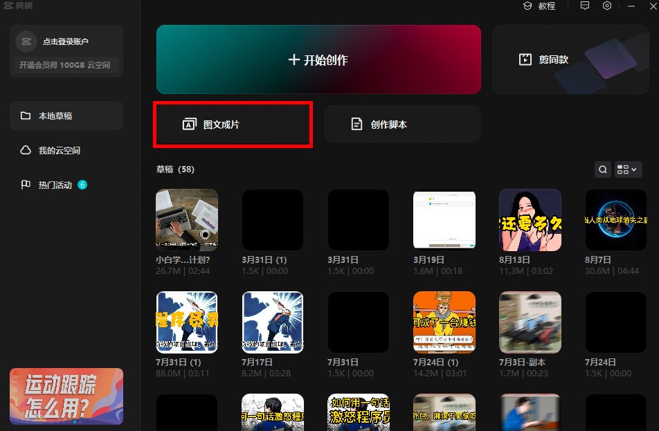

---
title:如何利用ChatGPT快速创作短视频？建议关注收藏！！！
summary: ✍ 有了ChatGPT这样的强大工具，我们是否可以利用其特长，让视频创作变得更加简单、更加易于上手呢？让我们一起来探讨如何通过ChatGPT来简化视频创作流程吧！
published: '2023-04-05T09:35:00.000+08:00'
cover: ./cover.png
tags:
  - [Markdown]
  - [chatGPT]
  - [Bing]
  - [AI]
---

## 手把手教你利用ChatGPT快速创作短视频

更多相关课程加入我的星球获取：

创作视频是一项非常耗费精力的任务，需要进行选题、撰写视频脚本、拍摄、剪辑和优化等多个步骤。尽管我也曾经尝试过短视频制作，但一直未能获得令人满意的反馈。其中一个主要原因是视频创作门槛较高，相比我们日常创作的图文来说需要更多的技巧和技术。

但现在，有了ChatGPT这样的强大工具，我们是否可以利用其特长，让视频创作变得更加简单、更加易于上手呢？让我们一起来探讨如何通过ChatGPT来简化视频创作流程吧！

前言
本篇内容的主题：让ChatGPT帮你创作视频。内容涵盖以下几个部分：

- 用ChatGPT创作标题
- 用ChatGPT创作视频文案脚本
- 结合剪映快速出片
- 趋势：数字人

#### 确认主题
在做短视频之前，你首先要确定这个短视频主题方向，如《小白如何深入机器学习》，《计算机应届生面试技巧》等等，这个是短视频创作的前提。

如果你连主题都不想思考，你可以把这个工作交给ChatGPT，你负责选择即可。但你至少要给ChatGPT一个大方向，比如“编程”、“AI绘画”、“人工智能”等具体的领域。你提供的方向越具体，得到的主题也越明确。

#### 用ChatGPT创作标题
主题确定好后，第二步，我们让ChatGPT帮我们生成标题。

接下来，我们以《小白如何深入机器学习》这个主题为例，我们可以这么提问：请围绕《小白如何深入机器学习》这个主题，扩展出10个适合抖音短视频的标题。

如果没有满意的，乘接上文，直接使用“继续”指令。比如：

ChatGPT会为你提供10个新的标题，还不满意，重复上面操作即可（但注意：继续指令通常可用4-5次，用多了后面出现雷同内容的概率会增大）

选择其中一个作为标题即可。

#### 用ChatGPT创作视频脚本

比如我们选择《从零开始，小白也能学会机器学习！》这个标题。可以尝试这么提问：

请用“从零开始，小白也能学会机器学习！”这个标题，帮我创作一个适合抖音平台的2分钟短视频，要求通俗易懂，最好小学生也能看的懂。

（小技巧：提问中可以适当增加一些举例说明，比如通俗易懂，那要多通俗，最好小学生也能看的懂，就很好表示了这个程度，大家可以多多尝试）

我们来看结果：

这样，一个短视频脚本就制作完成了，我认为画面和旁白都写的还是比较清楚的。如果觉得不满意，可以直接告诉它具体反馈，让它重新写即可。

我们归纳一下：你想做某个方向的短视频，我们可以借助ChatGPT，依次按方向、主题、标题、文案为顺序，逐步确定我们的最终的视频文案。

#### 结合剪映快速出片
ChatGPT可以大大提高我们输出视频文案的效率，但从文案到视频，依旧需要你完成很多如拍摄、剪辑、优化等动作。

这里分享一个快速成片的做法，你可以利用ChatGPT生成脚本、然后用剪映的图文成片功能快速出片。但此种方式，只适用于纯文本的脚本。

通常的做法是，我们要么删除视频脚本中的画面部分，仅保留旁白；要么就直接生成以文字旁白为主的视频脚本。我们这里再举一个例子。

比如我们继续选择“从零开始，小白也能学会机器学习！”这个标题，来让ChatGPT帮我们生成旁白脚本。效果如下：

此类视频，就是以旁白文字为主体的，我们可以直接利用剪映的“图文成片”功能，快速生成视频。

具体操作步骤如下：

1、打开剪映，选择“图文成片”

2、将ChatGPT生成的视频脚本，复制粘贴到剪映图文成片功能的编辑区域。如下图：

注意：这里需要去掉脚本中的画面描述部分。

3、点击上图“生成视频”即可坐等视频生成。

4、剪辑优化，根据个人需求，大家可以对剪映生成的视频直接进行二次编辑。

这样，我们就打通了ChatGPT+剪映快速创作视频的通路。一个擅长生成形象的文字，一个直接接收文字生成视频。

目前最火的AI绘画，也同样是这个原理，ChatGPT负责产出对图片精准的描述，绘画工具通过文字输入，生成对应的画作。

最近，AI绘画的课程也在积极准备中，很快也将出现在我们的系列课程里。大家敬请期待。

#### 趋势：数字人
数字人视频或直播，最近也非常火热。

特别适合不愿意出镜但又想做个人 IP的你，原理大体还是一样的。可以通过 ChatGPT + Midiourney + D-ID 的方式实现简单版的“数字人"。

主体实现思路是：

ChatGPT：负责生产视频脚本内容，并为Midjourney生产描述词

Midjourney：根据ChatGPT产出的描述词，生成数字人形象图片

D-ID： 将脚本和图片结合生成数字人视频

如果大家对数字人感兴趣，我也会在星球系列课程中，安排该内容的详细拆解。

后面我会在实战篇，为大家分享更多ChatGPT的实际应用案例，比如利用ChatGPT创作小说，辅助程序员工作等。

下期见！预计三四天内我们会在星球里再次更新，有兴趣的可以加入我的星球！

* 我们的优势是:
* 三天内可退款，不过度吹捧技术本身，不夸大技术制造恐慌去割韭菜！！！
* 全是干货，手把手教你怎么做，每天只要2毛钱，进来就送价值899元的python就业班全套课程+ChatGpt教程！
* 我们这里不仅有技术大佬，也有商业大神，带你技术层面，商业层面双突破！

资料包：

星球精品课程：

星球内部部分资料截图：

* 前10名还有超值优惠券，数量有限，加下面二维码速速领取！

### 必看

- 【程序员实验室】将提供以下服务:

   > 认知方面:普通程序员如何利用技术变现。
   > 知识技能方面:
    1. 后端开发原创知识库，海量学习资料。
    2. 关于python编程语言特性的知识分享以及前沿资讯。
    3. 编程圈最近流行的工具以及使用方法，包含但不限于ChatGPT。
  

- 🚀 不定时分享干货，有兴趣的可以关注公众号。

