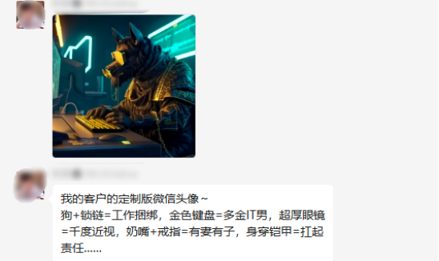

>之前我们讨论了如何创作小视频，你是不是第一反应是如何用到抖音，快手这些短视频平台生成视频变现。
>那咱们今天就来聊聊，在TIKTOK（海外抖音）这个赛道或者战场，我们如何利用chatgpt帮助我们变现。

#### 我们要做什么

开始之前，想请大家先思考一个问题，在你目前的认知中，你觉得应该如何使用chatgpt，换句话说可以用来做什么？

1. 向它提问，让它来回答问题？

2. 还是对它发号施令，让它替你完成某些事情？

这两句话看似类似，其实不一样，第一句话是你并不知道答案，你想通过提问，获得答案，就好像学生问老师，而老师授业解惑。而第二句话，更像是一个助理或者手下，你已经知道了你想要的结果，你只是需要有人去完成它。

没事，不忙着回答，咱们先来问chatgpt几个问题试试。

- 问题1：如何提高tiktok上的视频播放量

- 问题2：如何在TIKTOK上赚钱

这两个问题，就是我上面说的，向它提问，我们来看看它的回答。

第一个我问的是如何提高视频的播放量，这些说辞也很官方，说的都对，但总觉得它在跟我讲大道理哈哈。怎么说呢还不错了。

第二个我问的是变现方法，其实tiktok的变现方法很多，chatgpt会列出一些官方渠道的变现方式，这个可以理解，但你有没有发现，TIKTOKShop小黄车带货貌似它没有提到，这是为什么？因为chatgpt他的数据储备只到2021年，而小黄车大面积可以普及是2022年的事情了。

3. 知识储备有限，chatgpt其实你不要把它理解成一个机器，理解成一个人更加合适。他有一套完整的套路，给自己建立了一套知识框架和逻辑框架，所有的回答他都会按照这个框架来回答，但是能不能给出好的答案，完全取决于它的知识储备。而且它对不知道的事情有可能会编故事胡说八道。

那么，如果我们不向它提问，而是改做发号施令呢？比如说下面这个问题

请按要求给我写5个标题

怎么样，写的还不错把。虽然有股英文味儿，但是你可以让他再换几个说法很快就能得到很多很好的标题。

> 那么回到一开始的问题：我们应该如何使用chatgpt？

答案就是，我们要学会向它发号施令，做它的主人，而不是做他的学生。之所以要在一开始跟大家讨论这个问题，是因为我看到好多人像是把它奉若“神明”一般。

比如你说: 做TIKTOK有没有前途，是不是最好的时机。chatgpt说是的，难道我们不去研究就要盲目冲进场吗。它说不是难道我们就不做了吗？有点像求神一样。而且提问的答案其实对我们并没有什么太大的帮助。

总结一下，chatgpt并不是万能和无所不知的，我们要做的就是，知道自己准备做什么，然后让chatgpt来帮助我们提升效率，或者直接帮我们完成任务，这才是我们应该做的。

从上面的例子中，可以看出，我们向chatgpt提问其实是没什么用的，我们要知道做什么，然后发号施令让他来帮我们完成。

所以呢，放到tiktok变现，我们首先要有项目方法论，换句话说，就是你要知道要做什么项目，这个项目的是怎么实操的，项目要点在哪里，以及我们变现的整个闭环和路径。之后把难点拆解，逐一的扔给chatgpt去给我们完成。

关于项目方法论，我之后会详细拆分，这里我就不细说了。

OK，那么接下来，我假设说我们来做影视解说这个项目，我们来思考两个问题

1、 影视解说如何变现

2、 影视解说项目的难点在哪，我们如何利用chatgpt来帮我们解决问题。

问题1：变现

目前主流的方式是通过创作者基金，通过内容来奖励创作者。因为影视剪辑的内容非常受欢迎，因此通常能获得很不错的流量。

计算规则是，10W播放大约获得5美金左右的一个奖励，视频爆的时候一天可以获得几百美金，或者几百欧元的一个奖励，而且会持续的挖坟。群里的大佬每天晒收益我都看麻了哈哈。

问题2：这个项目的难点在哪呢？

做影视项目，特别是影视解说，有一个很大的难点，那就是非常耗时。我先给你说说看要做一个这样的视频得有多麻烦吧。

简单的来说，你得先有一个解说文案吧，然后翻译成外国语言。之后再做一个配音，配音结束以后你还需要做一个外文字幕。之后再剪辑视频，全部做下来，真的想想都头皮发麻。

以上面这个这个为例，我们一般会试用取巧的方法，拿现成的中文解说作品，然后它修改剪辑成国外配音，比如说英语，具体怎么做呢？

- 第一步：提取文案

首先，我们会需要把这个视频的字幕提取出来，这个我们一般使用剪映就可以了

- 第二步：翻译文案，提取出来以后呢，我得用翻译网站给他做一个翻译。

- 第三步，我们再把上面的文案拿去配音

- 第四步，把得到的全新的英文字幕，还有配音插入到剪辑作品里去。

#### 我们要到底要做什么

忙活了半天，你会发现，配音的内容和原来的画面一点都对不上。因为不同的语言在翻译上，他的读音长度也不同。这就坏了，因为配音了你还听不懂，特别难调整，只能一小段一小段的配音才能解决。

此刻的心情：准备摔键盘。整个视频搞完，新手慢一点的可能最少也要2小时以上了。而且效果也不怎么样，如果你看过TIKTOK的解说视频，你就会发现，普遍的语速都是非常的快，这就是因为配音和画面的差距太大了，只能通过提高语速来完整解说，观感是非常差劲的。

但别急，有了chatgpt，这事儿就非常简单了，上面的整个过程，在3分钟之内就能完成。

首先，在先把字幕提取出来，之后呢，直接让chatgpt帮你完整的翻译出来。

可以看到，翻译出来的内容，和原文的长度基本是一致的。

之后呢，我们可以直接配音，也可以直接使用现在最新的AI数字人配音（（https://www.d-id.com/这个网站可以通过文案生成数字人，有免费额度，可以尝试）），输入文案，自动生成动态的数字人配音作品。

然后呢，把字幕和配音好的数字人直接一起拖拽到剪辑软件中就完成了。怎么样，简单吧。别人生产一条视频的时间，你已经可以做20条了。而且质量也是非常高，整体的语速也很柔和，你甚至不需要去矫正画面和字幕，基本就是匹配的了。

上面我只是举例一个影视解说的流程。

更可怕的是，这整个流程，你甚至可以通过训练chatgpt，让整个流程实现自动化。

比如说，你看，通过训练chatgpt，我可以让它回答出任何我想要的答案。上面我举例子是直接用的现成的解说文案。那么假如说你想要自己写呢？只要你把同一个风格的解说文案，不停的投喂chatgpt，他就能很轻松的写出你想要的风格了。

可以想得到的玩法还有非常非常多。比如说现在国内教大家玩chatgpt的内容，是不是非常多呢？同样的，你完全可以用大家的文案，做成自己的内容，再配音放到titkok上，不仅可以获得流量，还可以吸引外国人到自己的私域变现。

再比如大家非常头疼的原创内容，也可以通过AI生成，都是独一无二的内容。直接文字转视频。比如下面这样的

还有大家都在做的前篇一律的带货视频，你是不是也可以使用数字人给大家讲解产品或者ChatGPT，绝对是眼前一亮。而这些都非常简单，就是向各种AI 软件发号施令就行了。

再比如一些定制化的需求，通过AI作图，你可以在tiktok上或者其他平台，提供这一类定制化的服务，比如说头像、logo等。

目前已经有不少人在做了，开设店铺，通过自己生成的图片产品赚钱，几乎没有成本啊。真的吊打一切原来的高成本定制作画产品。

甚至还有通过这个项目开始卖书的。简直可以说，遍地是商机。

怎么样，听我说完，是不是顿时感觉自己胸有成竹了？

说真的，chatgpt项目的出现，极大的缩短了新手和老手之间的差距，所有人站到了同一起跑线。就拿我举例子的影视剪辑来说，原本新手需要花好几个小时才能做好一个视频，现在，几分钟就可以完成了，而且质量还更高。

所以大家真的不能错过这一次技术革命，真的是新手逆袭的最佳机会。

但，chatgpt正如我前面跟大家描述的，你是需要掌握一定的技巧和方法，学会如何对它发号施令，让它去完成我们的任务。

大家有什么想法，都可以跟我探讨哈，如果对你有帮助请给我点赞谢谢~

- 后面我会在我的星球【程序员实验室】，为大家分享更多ChatGPT的实际应用案例，比如利用ChatGPT创作小说，辅助程序员工作等。

#### 早就是优势

我的星球【程序员实验室】目前定价169元，早鸟价69元，随着人数的增长阶梯式涨价！

估计早加入到小伙伴，都乐开花了。 因为星球有众多前沿资料，分享 ChatGPT 用于创新赚钱的最新机会

我估计看了分享的小伙伴，直接就觉得值回门票了，因为可复制性太强了，直接学了就可以拿来用。

* 我们的优势是:
* 三天内可退款，不过度吹捧技术本身，不夸大技术制造恐慌去割韭菜！！！
* 全是干货，手把手教你怎么做，学了就可以拿来用，每天只要2毛钱，进来就送价值899元的python就业班全套课程+ChatGpt教程！
* 我们这里不仅有技术大佬，也有商业大神，带你技术层面，商业层面双突破！

星球内部部分资料截图：

* 前10名还有超值优惠券，数量有限，加下面二维码速速领取！

### 必看

- 【程序员实验室】将提供以下服务:

   > 认知方面:普通程序员如何利用技术变现。
   > 知识技能方面:
    1. 后端开发原创知识库，海量学习资料。
    2. 关于python编程语言特性的知识分享以及前沿资讯。
    3. 编程圈最近流行的工具以及使用方法，包含但不限于ChatGPT。
  

- 🚀 不定时分享干货，有兴趣的可以关注公众号。

