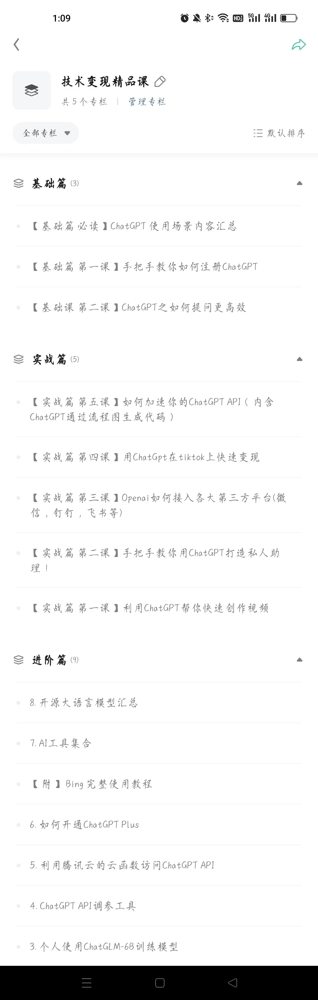

更多精彩系列课程

这篇文章主要内容

- 人工智能发展阶段
- 普通人如何赶上这个风口

> 最近阿里开始内测自己的AI产品“通义千问”，随后360也宣布开始内测自己的AI产品“智脑”，说明AI技术的发展正在进入一个全新的阶段。与过去20年的互联网浪潮类似，这一波AI浪潮将会带来巨大的机遇和挑战。
> 目前，中国的互联网发展已经经历了20多年的时间，而AI技术的能力只是刚刚开始显现，因此我们可以想象未来的AI想象空间有多么巨大。对于我们每一个人来说，必须时刻保持关注，思考如何依靠AI技术来创造新的价值。
 

我这里把AI技术的发展分为以下四个阶段：

#### 第一阶段，平台争夺时期。
这是当前AI技术发展的主要阶段，各大公司都在争夺生态位。

目前，**谁也没有依靠AI技术盈利**，即使是最牛逼的OpenAI目前也处于亏损状态。OpenAI在2022年在算力上就花费了4.16亿美金，折合人民币约28亿元，而ChatGPT每次查询的成本大约是谷歌传统搜索查询成本的7倍。

但这些不重要，因为巨头们有足够的财力，同时随着技术的不断升级，算力的成本最终会降下来。在这个生态位上站稳脚跟的公司将获得最大的收益。

在这个阶段，对于大多数人来说，还没有明确的赚钱机会，但实际上已经有很多人依靠这个市场赚到了不少钱。比如，第一批开始买卖ChatGPT账号的人，因为很多人不知道如何获取，所以这第一批买卖账号的人获得了商机，赚了一笔钱。

还有很多人依靠ChatGPT做成了一批收费的产品，比如小程序可以免费和它聊天，但如果超过次数就要收费。还有人做了ChatGPT谷歌插件，可以直接在浏览器和ChatGPT聊天，还可以批量导出ChatGPT的回话，当然了插件是收费的。

#### 第二阶段，百花齐放。
**当巨头们的竞争最为激烈的时候，也是创业者最美妙的时刻**。

巨头们为了抢占市场，肯定是尽可能给大家最大的让利和支持。 巨头们的产品差异应该就没那么大了，不像现在 ChatGPT 独占鳌头，别的产品几乎没什么能打的，其它巨头产品虽然差一点但肯定差不了现在这么大。

这个阶段，会出来一批极具代表性的产品。 肯定不像现在小打小闹的来个对话机器人，或者做一个小插件这样的产品，它至少应该是微信、美团、滴滴这种级别的产品。 这些超级产品会依赖巨头提供的AI算力，做出一批极具颠覆性的产品，打败微信的对手永远不是另外一个微信，而是超越层级的那种。 

当然了，这些产品也肯定不是小团队能搞出来的，至少是一些初创的创业公司。 这个时期，如果你可以看到机会，参与到早期的创业公司做相关产品，等公司上市之后又是一大波财富自由。 当然了这个阶段，我们普通人如果能站在这些超级产品之上做点事情，也应该能寻找到很多的机会，像微信公众号，抖音大V等。 

比如你用 AIGC 做了一个虚拟人物，成为某个AI平台的大V；再比如你利用 AIGC 帮你写小说，竟然成为了著名作家。当然，艺术性的东西是不容易被替代的。 AI 不会淘汰你，但使用AI的人会淘汰你，这个阶段对于大多数普通人还是有大量机会的。

#### 第三个阶段，人工智能走向成熟。

在百花齐放的阶段，最终会有一些优胜者，他们会凭借自己的技术和产品占据市场，从而形成垄断。在这个阶段，人工智能技术已经变得非常成熟，各种应用场景已经被广泛应用，包括医疗、金融、教育、工业等领域。人工智能不再是新鲜事物，而是成为了每个人都离不开的基础设施。

随着人工智能的成熟，人们的需求也会发生变化，不再只是简单的交互式问答，而是需要更加智能、更加高效的应用。比如，通过人工智能技术来实现自动化生产、智能分析、自动驾驶等等。在这个阶段，人工智能技术已经不再是一种工具，而是成为了基础设施的一部分，像水电一样自然人们已经离不开它了。

#### 第四个阶段，人工智能进入“意识”时代。

人工智能的发展会进入一个更加高级的阶段，即“意识”时代。在这个时代，人工智能将会拥有一定的自主性，能够对自己的行为进行评估和调整，具备一定的自我学习和创造能力。这意味着人工智能不再是一种简单的工具，而是具有自我意识和主动性的一种实体。

在这个阶段，人工智能将会在各个领域发挥重要作用，比如医疗领域的智能诊断、金融领域的智能投资、教育领域的智能学习等等。人工智能的能力将会远远超过人类，成为人类的重要助手和决策者。

综上所述，人工智能的发展经历了多个阶段，从平台打架到百花争鸣，再到人工智能走向成熟，最后进入“意识”时代。每个阶段都会有不同的机遇和挑战，但是只要我们能够时刻关注和学习，就一定能够在人工智能时代中获得成功。

### 作为普通人，我们能否赶上这一班车
Openai创始人说： 新的摩尔定律已经出现，也就是说每隔18个月，人工只能赋能的应用会翻一倍。可见AI发展速度有多快，那我们普通人能否跳上这趟飞速前行的列车。

我的答案是：**当然可以，但要趁早**

显而易见，我们正处于人工智能发展的早期阶段，也就是第一阶段到第二阶段之间，大厂全部站在同一起跑线,在激烈竞争，占有市场。 我们普通人有最好的机会，我们越早跳上这趟飞速前行的列车，我们的机会就越大。

就像我们曾经在学习使用智能手机和社交媒体时一样，我们现在也需要张开我们的怀抱迎接人工智能。 我们不必成为计算机科学家或人工智能专家，只需要学会使用一些AI工具和技术，就能够在我们的生活和工作中发挥想象力。就可以大大提高我们的效率，我现在已经在逐步探索在工作中使用它提升效率帮我写代码或者创作视频。它还能够改变我们的思考方式，让我们从单点细节扩展到集成化思维，可以让我们在未来更好地应对挑战。

如果你还没有开始学习它或者市面上信息太杂不知道如何学习，那要抓紧机会了，现在有超值福利送给大家，我这里给大家提供最新的ChatGpt教程，**免费送**，仅限前50人，扫下方二维码备注AI获取。

包括ChatGpt基础课程，进阶课程，认知课程，实战课程。手把手教你如何使用关键词，教你如何使用它作为你的私人助理（帮助你面试，口语，自动化生成代码），如何用ChatGpt生成创作视频， 也有BAT大佬教你如何训练自己的模型等等精彩内容。不用费力到处搜罗教程，你想要的我们这里都有！
很多前沿资料，学了就可以直接用，基础小白可以学，有代码基础的程序员更可以学。

期待大家的加入，让我们一起用AI走向更美好的未来。

### 必看

- 学系列课程可以加入我的星球【程序员实验室】，我们提供以下服务:

   > 认知方面:普通程序员如何利用技术变现。
   > 知识技能方面:
    1. 后端开发原创知识库，海量学习资料。
    2. 关于python编程语言特性的知识分享以及前沿资讯。
    3. 编程圈最近流行的工具以及使用方法，包含但不限于ChatGPT。
  

- 🚀 不定时分享干货，有兴趣的可以关注公众号。

