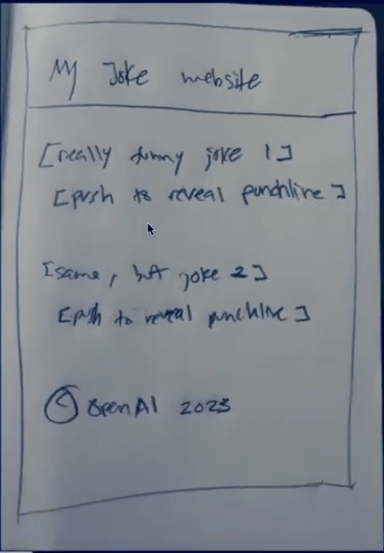
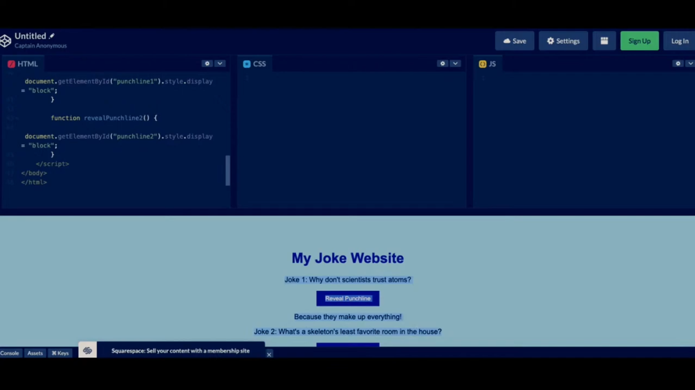
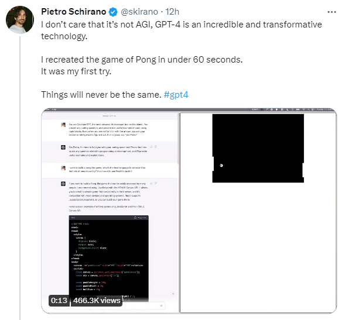
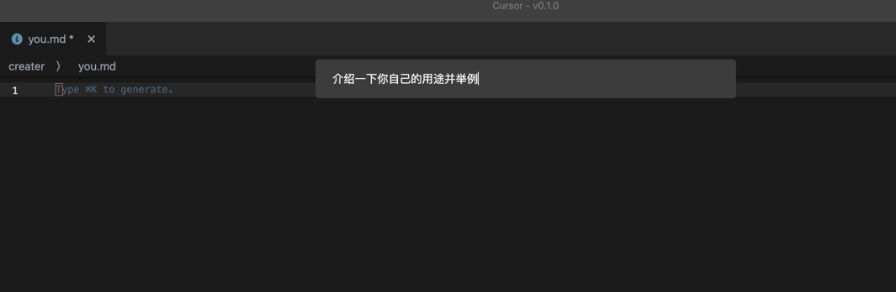
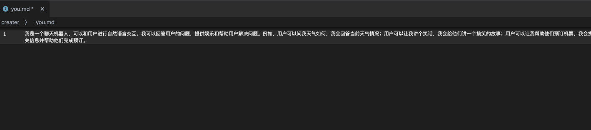
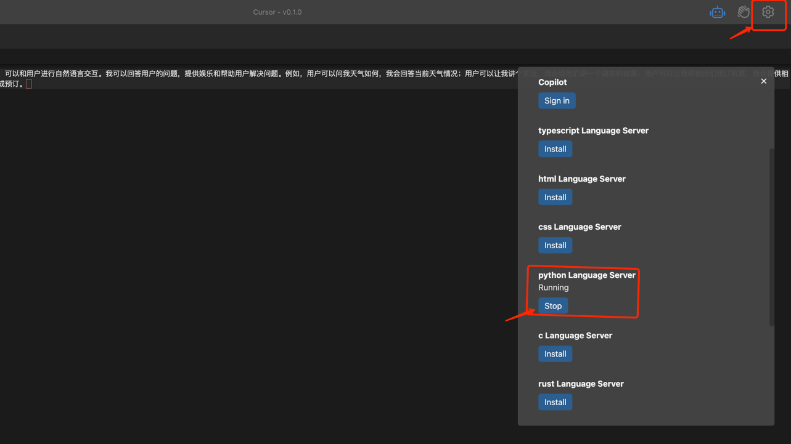

### 代码全自动化，不需要程序员了？
- 当人工智能GPT-4问世时，世界瞬间变得不一样了！这款顶尖的AI模型可以接受多达25,000个字的文本输入，这意味着它可以轻松处理复杂的数据和信息。

- 作为一名程序员，我看到以下两个案例，直接惊掉下巴，GPT-4还可以通过输入粗糙的手绘草图来生成网站，并在短短几秒钟内生成几乎与草图一样的网页代码。

- 生成的网站如下图，这还原度堪称一个逼真

- 此外，设计师Pietro Schirano还使用GPT-4重新编写了经典游戏《Pong》，并在60秒内成功完成了任务，真是令人叹为观止！

百度最近也发布了文心一言，不过在GPT4的衬托下黯然失色，甚至百度股价暴跌，网传梗图：

而我在好奇心的驱使下，尝试了各种代码代写工具，终于找到一款ChatGPT4赋能的编码神器：[Cursor]((https://www.cursor.so/))。
#### 下面我让它自己给大家自我介绍一下。

我下面演示一下它在代码里的强大用途，以python为例，先安装python服务

开始编写代码!我先让它写一个订单类

然后给出这段代码的详细解释

最后随便把代码改成错的，看它能不能修复

有种当场失业的感觉，但是GPT-4也并非完美无缺。例如，它可能会陷入与前代类似的问题，比如生成不实信息或错误答案。此外，由于其庞大的体量和复杂的训练模型，GPT-4的能耗也是一个问题。尽管GPT-4有许多卓越的技能，但它仍然无法取代人类的创造力和思考能力，而只是一种工具和辅助。

总体而言，GPT-4的发布标志着人工智能技术的又一次跨越式进步，它将进一步推动IT领域的发展，并对我们带来更多便利和机遇。

就像十年前的互联网一样，我们每个技术人员都应该利用好这场变革，要不也摆脱不了被淘汰的宿命，很多技术大佬，没有商业方面的认知，依旧会错过最好的赚钱机会。

以此为由，我和一些技术小伙伴创建了一个知识星球【程序员实验室】，原价格69元！！

现在免费福利发放，加微信[ToLiveIsToRest]回复chatgpt即可领取免费进星球的名额！
仅限前50个名额，星球初建，到50人就开始收费，技术小伙伴或者想了解chatgpt如何商业化的小伙伴千万不要错过了！！！！

程序员实验室将探讨如何使用技术进行变现。手把手教你如何注册chatgpt，以及使用chatgpt如何变现，让你沉浸在技术的快感中也能又更多不同视角的体验。

你将得到以下服务:
认知方面:
* 普通程序员如何利用技术变现。
知识技能方面:
1. 关于python编程语言特性的知识分享以及前沿资讯
2. 后端开发或者面试遇到的各种问题的解答
3. 编程圈最近流行的工具以及使用方法，包含但不限于ChatGPT！

## ✨必读：

- 对技术变现有兴趣的小伙伴可以加入我的知识星球，最近将分享很多关于ChatGpt的变现知识。
- 之后会开放转接api给无法使用chatgpt的小伙伴使用，加入程序员实验室即可得到最新资讯加微信[ToLiveIsToRest]回复chatgpt即可领取免费进星球的名额！

- 🚀 不定时分享干货，有兴趣的可以关注我公众号。

