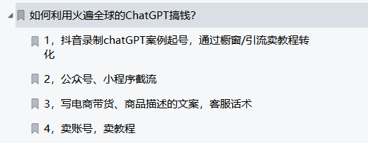

### 还在担心失业？有人已经用ChatGPT获得了第一桶金

观察现状, chatGPT的火爆已经对人们造成了比较大影响。有恐慌的，生怕自己下一秒就会失业的，也有兴奋， 甚至利用ChatGPT这个工具赚到了自己的第一桶金。

市面上也出了各种用ChatGPT赚钱的方法教程：

### 陷阱多多，还需冷静看待
目前有很多人通过包装一些基础概念和教你如何注册和使用GPT等方式，引发大家的焦虑和恐慌，让迫切想赚到钱的人们蜂拥而上。

对于这种行为我不做评价，只从自己的角度分析一下，为何我们在这种时刻需要冷静。

将时间节点拉长来看，尽管当前的行情不佳，就业也困难重重，每个人都想抓住风口，可是AI究竟能做到哪个程度，它真的成熟了吗，我觉得有待商榷。

我个人认为，被ChatGPT赋能等单点应用在未来2-3年会随处可见，看看现在的网络就知道了，遍地都是应用和工具，我自己甚至也想做一个网站玩玩，接入OpenAI的api的话，就技术本身而言，没有任何难度。

但是这些应用出现之仍然没有完全解决痛点，人类仍活在被工具奴役的世界。

举个栗子，如果我现在要做一个营销活动，那我要进行以下几个步骤：

1. 写邮件通知参与人员
2. 策划活动方案
3. 分配资金

这样下来每个环节都需要我的参与。即便AI可以嵌入到我的工具中，帮我更快地写邮件和计算资金，提高我的效率，但它仍无法完全解决我根本问题：业务流程过于复杂机械。

由此类推，集成化的应用才会对人类产生革命性的变革。通过将一系列被赋能的工具形成决策闭环，然后生成可行方案，人类只需做出最终决策，这样才能大大解放生产力和脑力，从而去做更重要的事情。

而AI集成化应用十分难落地，直到现在还没有产生。不过我相信总有一天会有一款杀手级应用的出现，我们需要再给它些时间。

面对人工智能掀起的热潮，我们需要理智看待，不要被市场上营造出来的焦虑情绪所影响。因为，目前看来，市面上单点应用能做的也十分有限，并不能完全解决痛点。

软件方面的发展也是符合摩尔定律的，作为人类，我们需要保持警觉，需要时时刻刻关注人工智能的发展.

企业也同样，应用该用AI赋能的赋能，赛道该换的换。

从程序员的角度看，我使用了很多由ChatGPT赋能的工具，最有用的我觉得是靠它搜索问题的答案，比某度不知道准了多少。

在代码方面暂时并不能完全取代我们，因为代码重复性较高，比较DEMO，算法相关的逻辑虽然比较严谨，但是缺乏连贯性。

不过，被取代也是时间的问题，毕竟0和1的世界，它当然是比我们更为熟悉。我们技术人员仙子应该思考的是如果我们的工作被取代了，我们如何退居高位，而不是退居低位。

我们要记住的是，在我们这一代，永远不会是被AI取代，而是被会用AI的人类取代。

人工智能来势汹汹，最先察觉到风口的一定是有敏锐的洞察能力和极高的认知。为了让普通的程序员小伙伴减少因为信息差带来的认知差异，
我创建了一个知识星球【程序员实验室】分享各种我从十分权威的渠道获得得资料以及技术内容，欢迎大家踊跃参与。
同时也告诉大家一个好消息，因为大家的热情，截至昨日，星球的前50名免费名额已满（免费体验人数不计入内），公众号上一篇有写。
现在开启付费模式，超值特惠69元，服务一年，进去即回本，阶梯式涨价，先到就是赚到。
前10名发放10元代金券，没赶上免费的同学千万不要错过这波福利啊！！！代金券和星球二维码均在下方

### 必看

- 【程序员实验室】将提供以下服务:
认知方面:
* 普通程序员如何利用技术变现。
知识技能方面:
1. 关于python编程语言特性的知识分享以及前沿资讯。
2. 后端开发原创知识库，海量学习资料。
3. 编程圈最近流行的工具以及使用方法，包含但不限于ChatGPT

- 🚀 不定时分享干货，有兴趣的可以关注公众号。

