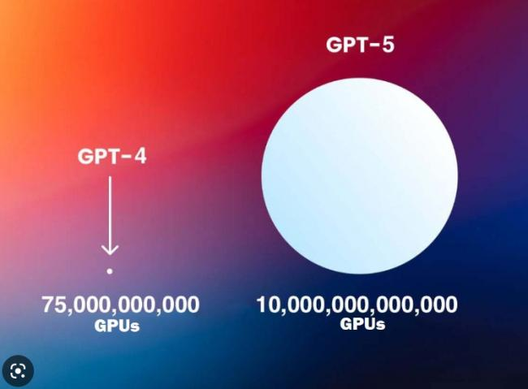
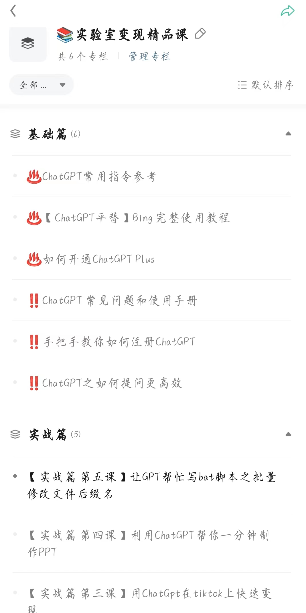
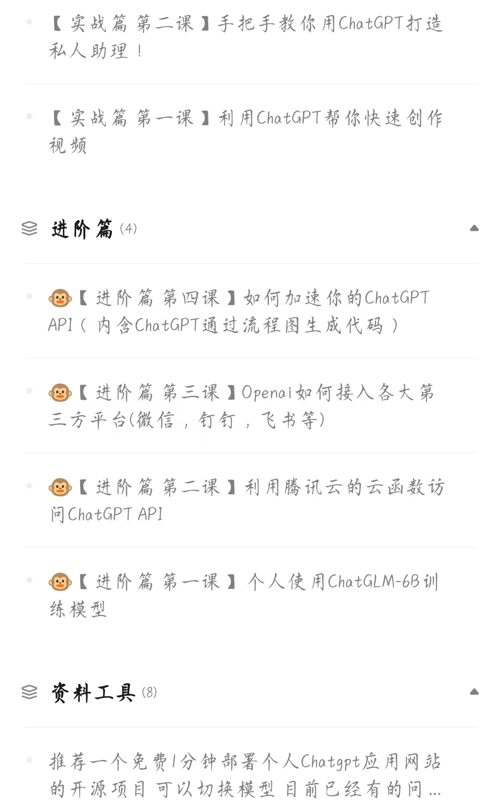
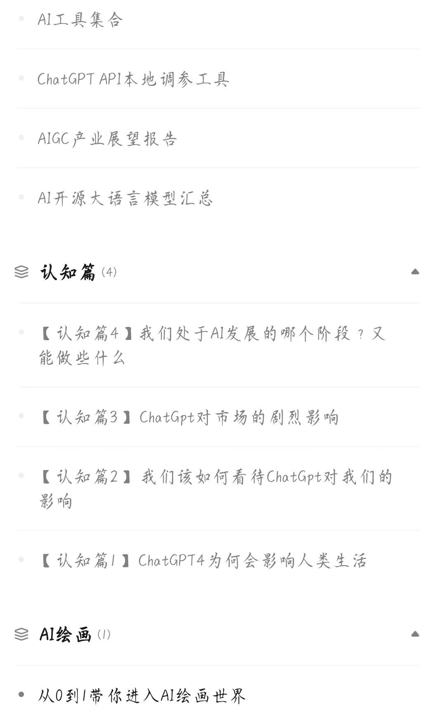

#### Gpt5两个月学完了人类所有的知识 ！

最近半年来，ChatGPT成为了最热门的产品之一。很多人使用GPT来帮助工作、学习以及提高效率。尤其是GPT4，其性能比GPT3.5强很多倍！

虽然GPT4已经很强大了，但是比它更强大的AI系统已经完成了训练。最新的消息是，GPT5已经完成了对人类网络上所有视频（**大约2000PB的容量**）的浏览（确切地说是“看完”），并能瞬间标记出这些视频中的所有声音和光线信息，精确到每一秒钟。

举个例子，如果要在75亿人中找到一个特定的人，只需提供一些基本参数，**GPT5就能在几十秒内**找到他，并为他生成人类世界有史以来最全面的数字特征图像，以及最完整详细的解释和说明。此外，GPT5还可以准确预测这个人的未来行为和寿命极限。

目前，即使在现阶段，**GPT5已经可以完成成千上万类似的任务。它仅用了两个月的时间就学习了人类数千年来积累的所有知识**。

总之，GPT5的强大和高效已经远远超出我们的想象。

#### 应用井喷下，普通人该如何破局

ChatGPT技术的强大可以预见在不久的将来将会掀起应用的井喷式爆发。熟练掌握ChatGPT已成为必备技能，就像几十年前掌握电脑打字、使用office一样重要。

但是，会不会有一天我们的职业被ChatGPT所取代呢？这是一个普遍存在的担忧。有句话说得很有道理，原始社会强壮的人会对你构成威胁，文明社会聪明有才华的人会对你构成威胁，而在未来，擅长使用AI技术的人可能会成为最大的竞争对手。

的确，智能AI带来的挑战也同时带来了机遇。对于普通人来说，如何应对这一挑战，如何抓住机遇，是一个实际且不可回避的问题。就像移动互联网的出现一样，整个社会的运行规则被彻底改变了。

4月12日，**微软宣布开源了Deep Speed Chat**，帮助用户轻松训练类ChatGPT等大语言模型，**使得人人都能拥有自己的ChatGPT**！（开源地址：https://github.com/microsoft/DeepSpeed）

据悉，Deep Speed Chat是基于微软Deep Speed深度学习优化库开发而成，具备训练、强化推理等功能，还使用了RLHF（人工反馈机制的强化学习）技术，可将训练速度提升15倍以上，成本却大幅度降低。例如，一个130亿参数的类ChatGPT模型，只需1.25小时就能完成训练。

简单来说，用户通过Deep Speed Chat提供的“傻瓜式”操作，能以最短的时间、最高效的成本训练类ChatGPT大语言模型，这标志着一个人手一个ChatGPT的时代要来了。

因此，我们需要认真思考如何在这个风口中破局。无论是拓宽自己的技能树、增强自身的竞争力，还是积极创新、开拓新的市场，都是值得尝试的方向。只有不断适应时代的变化，才能在未来的竞争中获得胜利。

#### AIGC就是20年前的互联网

人工智能技术的发展给我们带来了许多惊人的成果，AIGC（AI generated content）人工智能生成内容，已经成为一种新型的内容创作方式，受到越来越多的关注， 其中最受瞩目的就是像ChatGPT这样的语言模型

AIGC通过机器学习和自然语言处理等技术，可以帮助用户快速生成高质量的文本内容、音频、视频、图片等多种形式的内容，使得内容创作变得更加高效和便捷。

未来，AIGC技术将会越来越普及，它将有望成为数字时代的主流内容创作方式。这种技术将为用户带来更多创作和表达的自由度，帮助他们更好地实现自己的创作梦想。同时，AIGC还能帮助企业、品牌、机构等快速生产大量的内容，以满足市场需求，提高品牌知名度和竞争力。

如果你想快速上手、熟练应用 ChatGPT，获取第一手关于 ChatGPT 的资料，利用 ChatGPT 提升工作效率，获取 ChatGPT 变现机会等。

欢迎你加入我们的AIGC交流群社群，一杯奶茶钱，即可获取入群资格。群里有BAT资深技术大佬+创业多年的商业大佬，全方位的解答你的问题。进来就送ChatGPT永久独立账号（内含五美金API） + 进入星球的资格。

扫下方二维码备注AIGC入群，库存已经不多，先到先得：

顺便介绍一下我的星球【AIGC实验室】：

星球内部课程持续更新，小白可以学，技术人员更可以学。可复制性极高，学完拿来就可以用。

我们提供的服务有：
认知方面:
* 普通人如何利用AI破局。
知识技能方面:
1. 关于最前沿AIGC的技术资料和海量学习资料，包含但不限于ChatGPT。
2. 手把手教你如何使用AIGC提高效率/创建自己的应用，包含但不限于ChatGPT。
3. 交流探讨如何使用AI技术变现，包含但不限于ChatGPT

不定时分享干货，有兴趣的话扫下方二维码关注哦~

