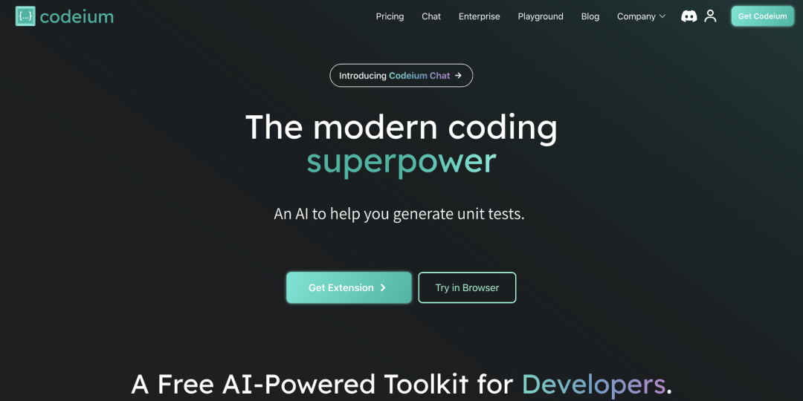
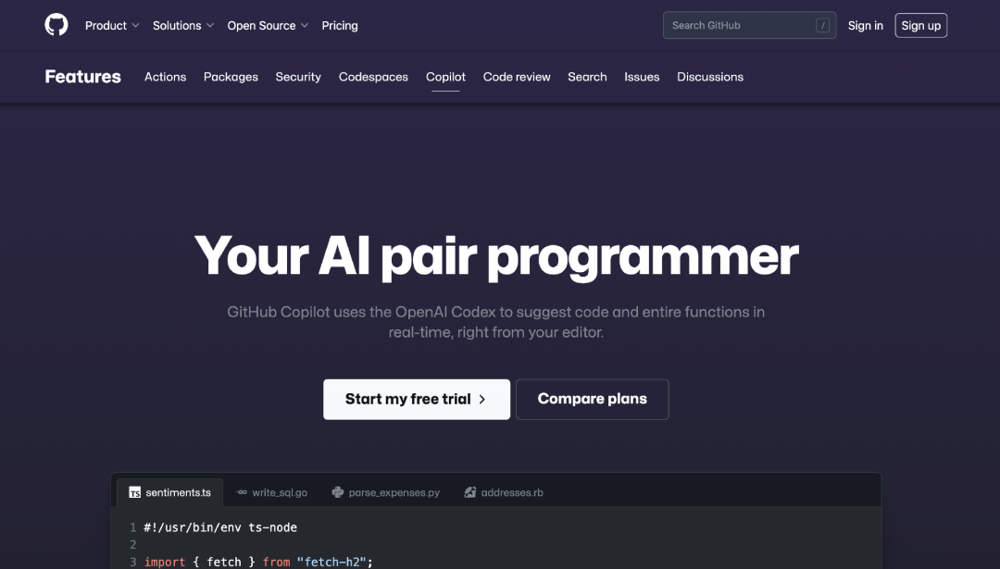
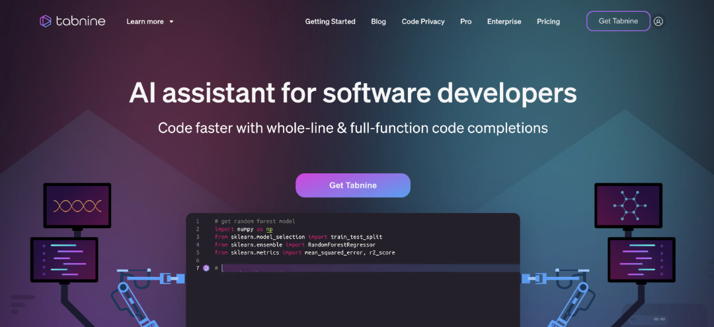
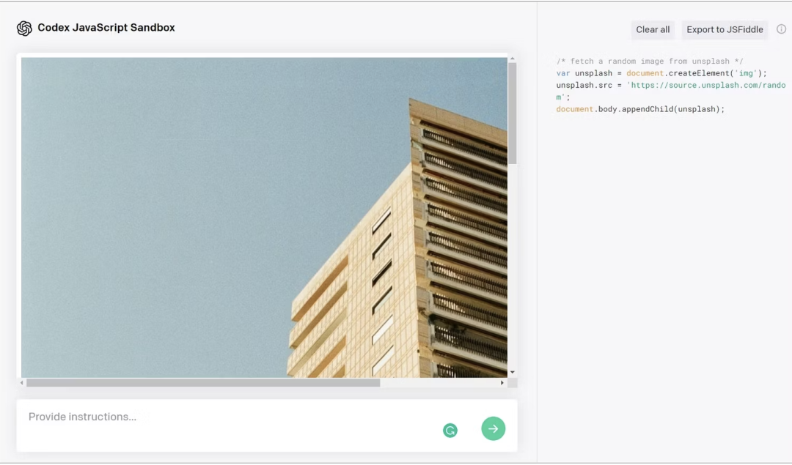
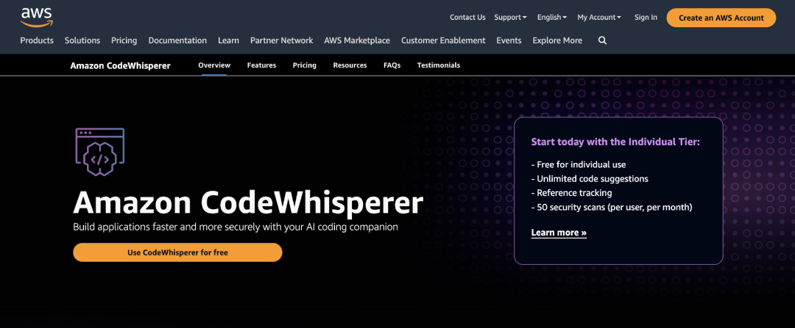
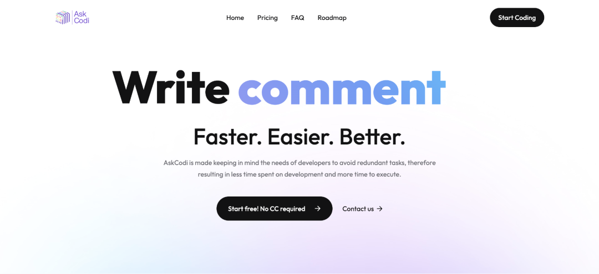
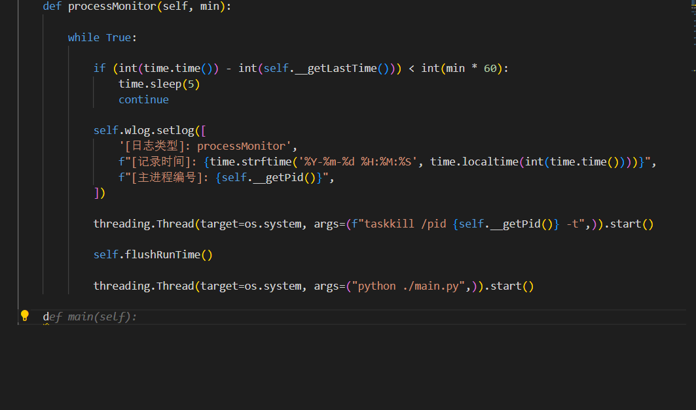

ChatGPT是一个优秀的人工智能工具，可以根据自然语言提示自动生成代码。然而，对于程序员来说，它可能无法完全满足开发者的需求。下面我来介绍7种更专注于编码的人工智能工具。
1. Codeium(https://codeium.com/)
Codeium是一个免费的人工智能驱动的代码生成工具，它能够帮助开发人员更快地编写代码，减轻他们的负担。Codeium使用了大型公共代码数据集进行训练，使其生成的代码更准确。它还可以生成测试用例来简化测试驱动开发，并可以根据上下文或注释在相关的代码中搜索和插入API端点。

Codeium有如下特点：
- 支持超过40种编程语言，如C++、Go、Java、JavaScript、Rust、Python、PHP等。
- 可以从自然语言注释或以前的代码片断中生成代码。
- 可以生成测试用例来简化测试驱动开发。
- 可以根据上下文或注释在相关的代码中搜索和插入API端点。
- 与流行的IDE集成，如VS Code、JetBrains、Jupyter/Colab Notebooks、Neovim、Emacs和VSCode Web IDE。
- 企业版允许公司在他们自己的服务器或云中部署Codeium，确保代码保持私密性。

2. GitHub Copilot(https://github.com/features/copilot)
GitHub Copilot是由GitHub和OpenAI联合开发的人工智能辅助工具，旨在帮助开发人员更快地编写代码。使用Copilot，程序员可以在写代码时得到即时的智能建议，从而更轻松地实现自己的想法。它可以快速生成符合上下文的代码，减轻开发人员的负担。

GitHub Copilot有如下特点：
- 支持多种编程语言，如Python、JavaScript、TypeScript、Ruby、Go、PHP、C++、C#、Java、HTML、CSS、SQL和Shell。
- 根据上下文推荐代码片段、建议变量名、函数和整个代码行。
- 可以根据自然语言写的注释来生成代码。
- 可以作为Visual Studio Code（VS Code）、Visual Studio、Neovim和JetBrains的IDE套件的扩展。
- 需要订阅才能使用。

3. Tabnine(https://www.notion.so/)
Tabnine是一个自动代码生成工具，它可以在你的IDE中工作，根据你以前的代码和注释来生成代码。Tabnine支持超过30种编程语言，例如JavaScript、Python、TypeScript、Rust、Go和Bash，并可以在专业版中托管和训练自己的人工智能模型。它能够在本地或云端运行，取决于合规性和安全需求，并与主要IDE集成，例如VS Code、Neovim、Rider和Android Studio。

- 支持超过30种编程语言，如JavaScript、Python、TypeScript、Rust、Go和Bash。
- 根据以前的代码和注释生成代码。
- 可以在使用专业版时托管和训练出自己的人工智能模型。
- 能够在本地或云端运行，取决于合规性和安全需求。
- 与主要IDE集成，如VS Code、Neovim、Rider和Android Studio。

4. Codex(https://platform.openai.com/docs/guides/code)
Codex是由OpenAI开发的一种语言模型，可根据自然语言提示（例如问题描述）生成代码，它是为GitHub Copilot提供支持的模型。Codex支持多种编程语言，例如Python、JavaScript、Java和C++，接受了自然语言和数十亿行代码的训练。Codex可以通过OpenAI Codex API获得，允许开发人员将其集成到他们自己的应用程序和工作流程中，并可以免费使用。

- 支持多种编程语言，如Python、JavaScript、Java和C++。
- 接受了自然语言和数十亿行代码的训练。
- 可以通过OpenAI Codex API获得，允许开发人员将其集成到他们自己的应用程序和工作流程中。
- 可以免费使用。

5. CodeWhisperer(https://aws.amazon.com/cn/codewhisperer/)
CodeWhisperer是由亚马逊创建的代码生成工具，它可以根据上下文和评论生成代码建议，并支持安全问题扫描。CodeWhisperer支持多种编程语言，例如Java、JavaScript、Python、C#和TypeScript，并可以与现代IDE集成。在预览期间免费使用，开发人员可以使用CodeWhisperer来加快他们的开发过程，同时确保代码质量和安全性。

CodeWhisperer有如下特点：
- 支持Java、JavaScript、Python、C#和TypeScript。
- 可以通过AWS Toolkit for Visual Studio Code与Visual Studio Code等现代IDE集成，以及通过AWS Toolkit for Jetbrains与JetBrains、AWS Lambda控制台和AWS Cloud9集成。
- 可以根据上下文和评论生成代码建议。
- 支持安全问题扫描。
- 在预览期间免费使用。

6. Intellicode(https://visualstudio.microsoft.com/zh-hans/services/intellicode/)
Intellicode是用于Visual Studio的免费AI代码生成工具，通过检测代码的上下文并提供代码建议。Intellicode支持Python、TypeScript/JavaScript和Java编程语言，接受了GitHub上具有高星级评分的开源项目的培训，并提供了超过100k个API的使用示例。Intellicode仅适用于Visual Studio IDE。

- 支持Python、TypeScript/JavaScript和Java编程语言。
- 接受了GitHub上具有高星级评分的开源项目的培训。
- 提供了超过100k个API的使用示例。
- 仅适用于Visual Studio IDE。

7. AskCodi(https://www.askcodi.com/)
AskCodi提供了一个全面的工具来帮助开发人员快速生成代码，它有不同的应用程序来生成不同类型的代码。AskCodi支持30多种编程语言和框架，例如Kotlin、JavaScript、Angular、Ruby、Swift、Python和Rust等，还提供了WordPress和Powershell问题的答案。AskCodi在终端上可用，可以与VS Code和PyCharm等IDE集成，并支持除英语之外的多种自然语言，如德语、波兰语和西班牙语。AskCodi可以将代码片段从一种编程语言翻译成另一种编程语言，并且有一个功能有限的免费版本和一个具有高级功能的付费版本。

- 支持30多种编程语言和框架，例如Kotlin、JavaScript、Angular、Ruby、Swift、Python和Rust等，还提供了WordPress和Powershell问题的答案。
- 在终端上可用，可以与VS Code和PyCharm等IDE集成。
- 支持除英语之外的多种自然语言，如德语、波兰语和西班牙语。
- 可以将代码片段从一种编程语言翻译成另一种编程语言。
- 有一个功能有限的免费版本和一个具有高级功能的付费版本。

我试用了一下，最喜欢的是Codeium，不仅免费。在vscode中安装插件后，可以直接帮我补全代码，如下图，它猜到了我需要一个main函数。直接按tab键，即可帮你补全代码，很是方便~

尽管ChatGPT是一种出色的AI工具，但是还有其他一些更专注于编码的AI工具，这些工具可以帮助开发人员提高编码效率，减少代码编写量。通过GitHub Copilot、Codeium、CodeWhisperer、Tabnine、Codex、Intellicode和AskCodi等AI工具，开发人员可以根据自然语言提示、上下文和注释生成代码，从而快速生成复杂的代码段。然而，在使用这些工具生成的代码之前，必须进行彻底的测试和审查。这些AI工具应该被看作是编码辅助助手，而不是完全取代程序员。

参考链接：https://www.makeuseof.com/chatgpt-alternative-for-coding-programs-automatically/

🚀 不定时分享AIGC相关资讯，有兴趣的可以关注我的公众号~

