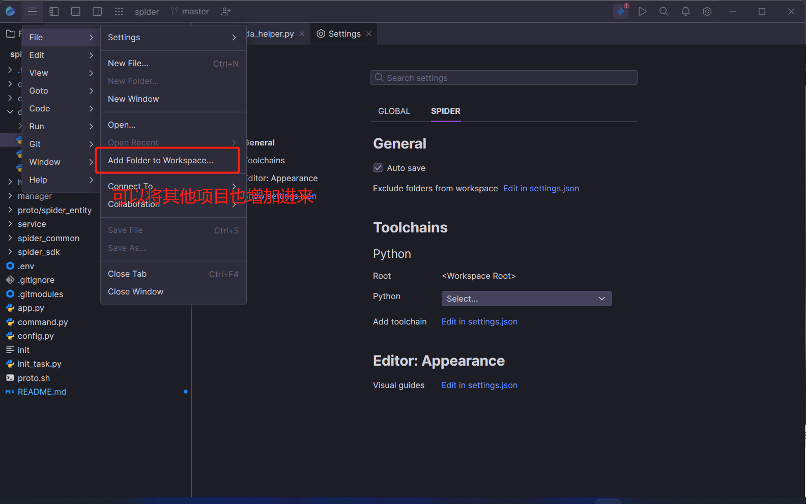
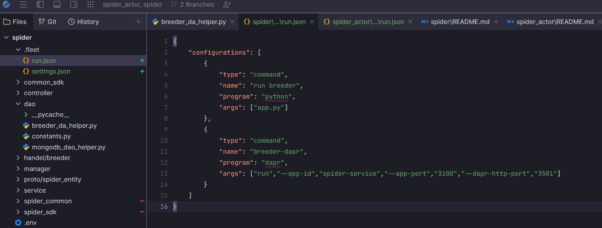

## 期待一年的fleet终于上线了！

JetBrain Fleet是一款由JetBrains开发的云端集成开发环境（Cloud Integrated Development Environment，简称IDE）。
它可以让开发人员在任何设备上进行编码、调试、测试和部署，无需搭配本地的开发工具。
fleet和其他jetbrain系列编辑器一样，管理项目是以workspace为单位，目前支持大多数语言。
#### 体验下来，编辑器代码搜索分析还是复用的JetBrains自研的代码分析引擎，是熟悉的感觉，很多新功能还没有很完善，详细功能文档请参阅最下方链接，下面来介绍一下它基本的使用方法。

- 1. 界面如下图：
点击设置中的主题切换

- 2. 👷 打开一个项目建立一个workspace
选择一个文件夹并打开

- 3. 📁 加入项目到此workspace
点击file，加入文件夹到此工作空间，如下图

- 4. 🤗 开启smart模式
如果不开启的话不具有代码分析功能，不能识别出你的代码类型所需要什么编译器等等功能。
所以如果我们要写代码，需要自动补全，语法分析，就需要开启，开启方式很简单，点击一下右上角的小闪电即可。
然后你就可以开始快乐写代码了

- 5. ⚙️ 启动并运行代码
如果开启smart模式，fleet会分析出代码属于什么文件，需要什么编译器或者解释器，我这里以python为栗子。有两种方式配置python解释器
    - a. 在配置中设置每个项目的解释器，如下图
    - 
    - 
    - b. 配置命令行，需要在工作区增加启动文件run.json,在配置文件中配置启动命令，比如说我这个项目需要运行app文件，也需要开启一个dapr的边车服务，那么我的配置如下图
    - 
添加完后直接点击右上角的箭头运行一下即可。

- 6. 🔎 搜索
按 <kbd>ctrl+shift+f</kbd> 或者点击右上角的放大镜。这里搜索是支持正则匹配的。

- 7. 🚀 云端环境
目前fleet支持多端联调，比如在公司里的代码，通过生成sessoin url，那么在家里的电脑，可以通过join sessoin的功能加入这个环境，不用再重新搭建环境。
方法如下。

## fleet真的可以和vscode抗衡吗？

从客观角度，很难说Fleet是否会取代VsCode，两者虽然都是轻量级编辑器,但是，这两款工具在功能上有所不同。

VS Code是一款由微软开发的跨平台文本编辑器，支持多种编程语言，并具有丰富的扩展插件。它被广泛应用于 Web 开发、游戏开发、数据科学等领域。

JetBrain Fleet则是一款云端集成开发环境，它提供了丰富的代码完成功能和多种语言支持，可以帮助开发人员更快地完成任务，并且可以让开发人员随时随地进行开发。

因此，JetBrain Fleet和VS Code在功能上存在一定的区别。在某些情况下，JetBrain Fleet可能更适合开发人员进行集成开发，而VS Code则更适合开发人员进行文本编辑和代码编写。因此，JetBrain Fleet和VS Code可能会在不同的应用场景中各自发挥作用，而不是完全取代对方。

## 刚出来就扑街？
### 看到网上有很多fleet测评，大部分都是说功能还有很多不完善的地方，包括作为一个轻量级引擎，启动却需要大内存这种令人诟病的性能问题。我觉得fleet还有很大可以优化的空间，比如说git管理，ssh连接，以及容器管理。如果后续能更加方便的容器编排，那我觉得未来还是很可期的。

## ✨补充：

- fleet下载入口[fleet下载](https://www.jetbrains.com/fleet/)。
- fleet详细功能文档[功能文档](https://www.jetbrains.com/help/fleet/getting-started.html)。
- 🚀 不定时分享干货和开源工具，有兴趣的可以关注下方公众号。

