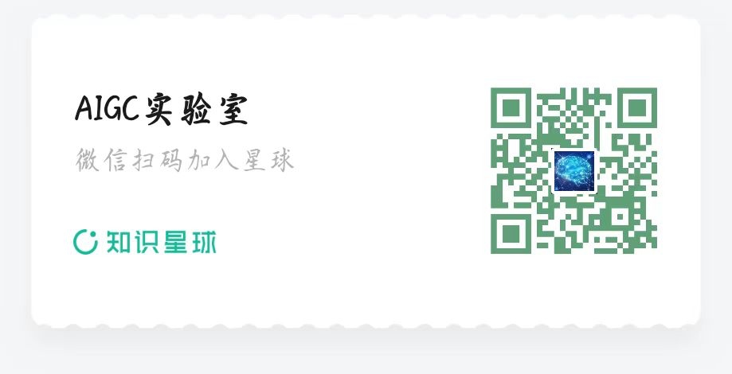
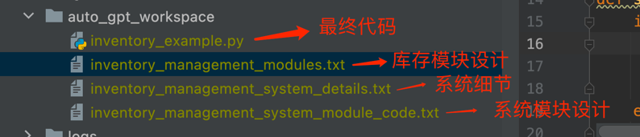
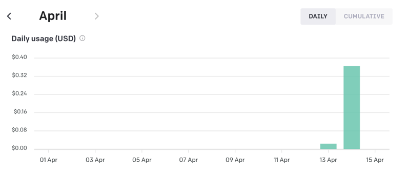
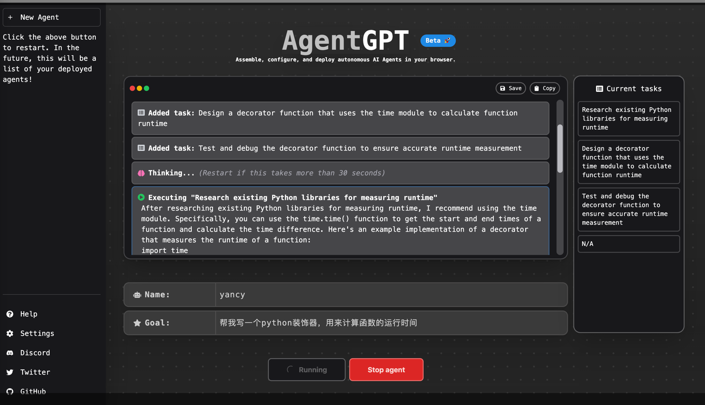
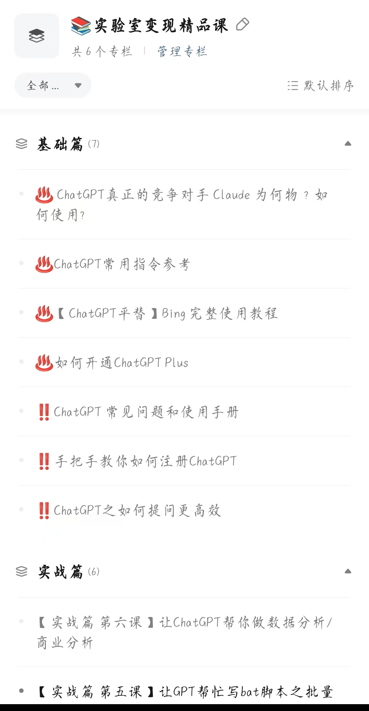
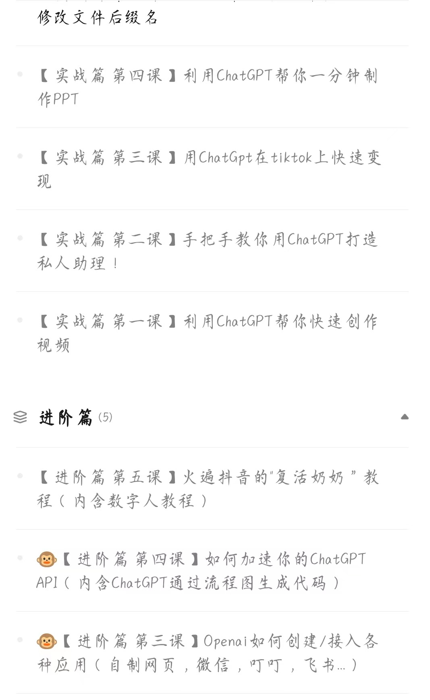
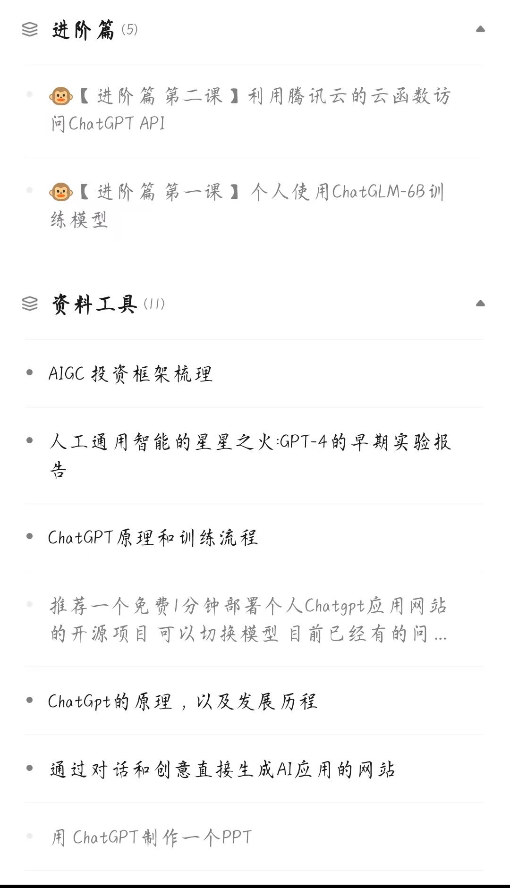
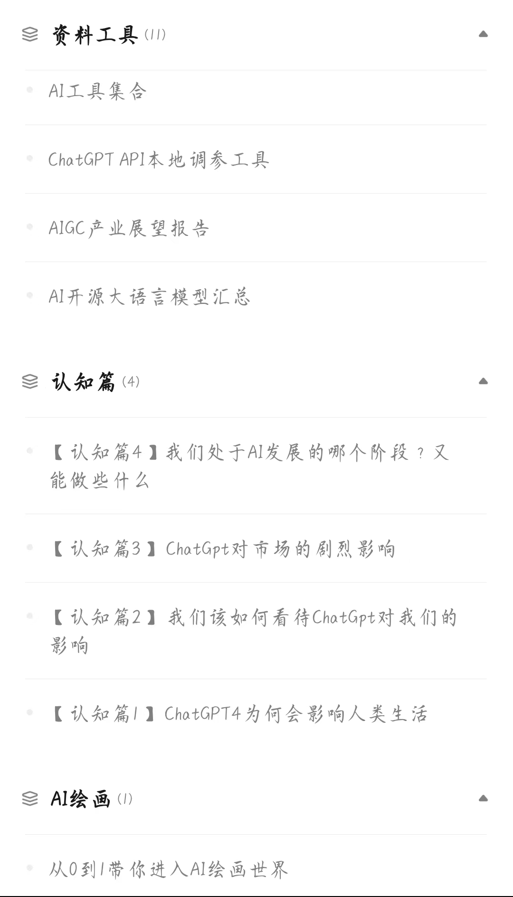

更多精彩系列课程入加入星球获取

你好，这里是Yancy，今天继续跟你分享人工智能相关的新鲜见闻。

#### autoGPT是什么，为什么突然爆火？

近日，自主人工智能似乎成为了人工智能领域的一股新趋势。AutoGPT是一个基于GPT-4技术的开源项目，它可以根据任务指令自主分析和执行，并且甚至可以自己提出新问题并回答，，短短几天，在GitHub star达到近4万了，可见这个项目多火爆。

与ChatGPT不同的是，AutoGPT不是简单的对话机器人，而是一个具有自主执行任务能力的智能体。您可以通过GitHub下载源代码并进行部署安装。

AutoGPT最大的特点是它可以根据任务指令自主分析和执行，并且可以自己提出新问题并回答。它相当于给基于GPT模型的一个内存和一个身体。因此，您可以将任务交给AI智能体，让它自主地提出计划并执行。此外，AutoGPT还具有互联网访问、长期和短期内存管理、用于文本生成的GPT-4实例以及使用GPT-3.5进行文件存储和生成摘要等功能。因此，AutoGPT在分析市场并提出交易策略、提供客户服务、进行营销等其他需要持续更新的任务方面非常有用。

AutoGPT可以帮助您自主开发网站，甚至可以自己上网、使用第三方工具、思考和操作您的电脑。这种方式打通了“行动→观察结果→思考→决定下一步行动”的循环，因此在许多任务中都非常有效。

如果您需要进一步了解AutoGPT，可以访问其GitHub页面并进行下载和部署安装。
 
地址：https://github.com/Significant-Gravitas/Auto-GPT.git

仓库中有完整的AutoGPT教程，这里我就不教大家如何部署了，跟着github中去做就可以了。

AutoGPT使用的时候，需要设置目标为避免出现问题，最好从简单的目标开始，对输出进行测试，并根据自身需要调整目标。

我这里测试了一下，用的是3.5的api，它的思考过程仿佛是一个专业的开发工程师。

从上面的视频中可以看到，我给它的人设是一个高级开发工程师，目标是让它帮我设计一个库存管理系统，但是它没有像ChatGPT立即帮我生成代码，而是开始制定策略。
大致分为下面几步
第一步：去谷歌一下库存管理系统。第二步：确定工程的规模大小。第三步：写出系统模块大致框架文件。第四步：写出系统模块细节文件。 第五步：根据模块写出代码。第六步：写出测试代码。
所以最后它生成了不止一个文件，而是下面四个，写出代码后，它甚至还会调用你的系统命令python去执行文件并输出结果，所有的一切，全盘接手。

不过，你如果想要释放AutoGPT的全部潜力，需要GPT-4 API访问权限。GPT-3.5 可能无法为智能体或响应提供所需的深度。
注意：autoGPT对token的消耗量很大，因为它每一步的策略执行就是以GPT的api为内核的。我运行了两个例子，已经花掉了快3美分～

#### AgentGPT-带有可视化网页的AI自主机器人

对于对编程没有经验的人来说，AutoGPT使用起来很困难，所以这里我给大家介绍另外一个自主人工智能AgentGPT 。
它是一款可以在线使用的 AI 自主机器人。它的使用非常简单，只需要打开官网并按照提示即可开始使用。
使用地址：https://agentgpt.reworkd.ai/

例如，我们可以使用其中的 PaperclipGPT 机器人，将目标设置为制造尽可能多的回形针。
然而官方提示，由于该项目非常火爆，需要使用自己的 OpenAI API 才能获得稳定的使用体验。
如果你没有自己的 OpenAI API，也可以体验 AgentGPT，但是可能无法长时间使用。这可以理解，毕竟每次调用 API 都需要付费。

如果你对 AgentGPT 感兴趣，尽快去体验吧。由于使用人数众多，随时可能会访问不了。

看样子，我们离通用人工智能（AGI）越来越近了，未来充满了无限的想象空间。

AI发展速度超乎了我们的想象，为了让更多人了解到AI发展的最新动态，探讨如何使用AIGC技术进行变现，我们创建了AIGC社群，用来交流讨论AIGC的新玩法。

拒绝白嫖，一杯奶茶钱，即可加入，加入就送ChatGPT永久独立账号，内含5美金的API。

下面来介绍一下我的星球【AIGC实验室】

包括AIGC的前沿资讯，和系列课程，小白可以学，技术人员更可以学，可复制性极强，学完了拿来就可以用

进来送ChatGPT独立永久账号（进入星球三天后发放）+免费入社群+星球所有课程（课程持续更新）
有兴趣请扫下方二维码备注AIGC：

期待大家的加入，让我们一起用AI走向更美好的未来。

- 🚀 不定时分享干货，有兴趣的可以关注公众号。

