更多相关课程加入我的星球获取：

这两天ChatGPT在大规模封禁账号，数百万亚洲账号被封禁不能使用，如果你的ChatGPT这两天暂时没法用，可以先试试新版Bing。据新版Bing所讲，它集成了GPT4技术，我们可以体验一下效果

本篇内容的主题：新版Bing完整使用教程

- 新版Bing是什么？
- 新版Bing VS ChatGPT
- 新版Bing完整使用教程
- 常见问题以及解决方案
- 新版Bing是什么？

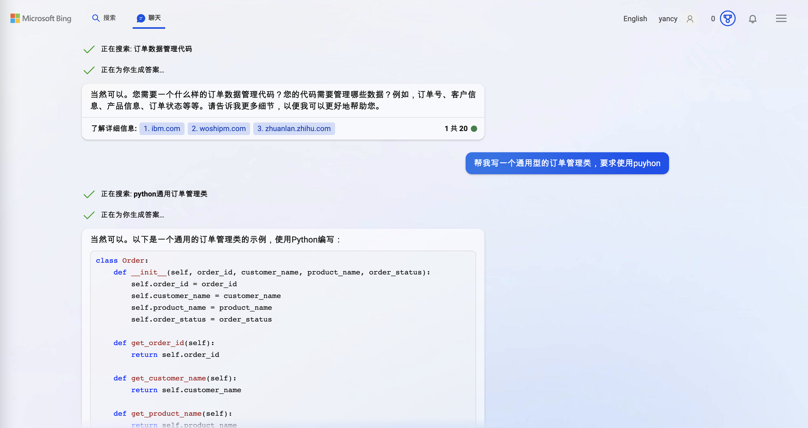

#### 新版Bing是什么？

我们知道，Bing是微软的搜索引擎，而新版Bing，我们可以看到图片左上方出现了【搜索】和【聊天】两个标签页。

这说明我们可以像传统方式来检索内容；也可以向使用ChatGPT一样，向新版Bing提出具体的问题。从上方yancy和新版Bing的对话中可以看出，新版Bing也足够智能，识别出了我的拼写错误。

新版Bing是什么？按官网给出的概念：

新必应就像你在网上搜索时身边有一位研究助理、个人规划员和创意合作伙伴。使用这组由 AI 提供支持的功能，你可以:

询问你的实际问题。当你提出复杂问题时，必应会提供详细的回复。
获得实际答案。必应在网上查找搜索结果，为你提供汇总答案。
发挥创意。当你需要灵感时，必应可以帮助你编写诗歌、故事甚至分享关于项目的想法。
在聊天体验中，你还可以聊天并提出后续问题，例如，**“能否用更简单的术语进行说明”**，或者 **“为我提供更多选项”**，以便在搜索中获取不同甚至更详细的答案。这些操作，类似于我在ChatGPT基础篇中讲到的ChatGPT指令。

#### 新版Bing VS ChatGPT
同样都是与AI聊天，新版Bing和ChatGPT有什么不同呢？

从上面我发的图可以看出一些区别，比如：

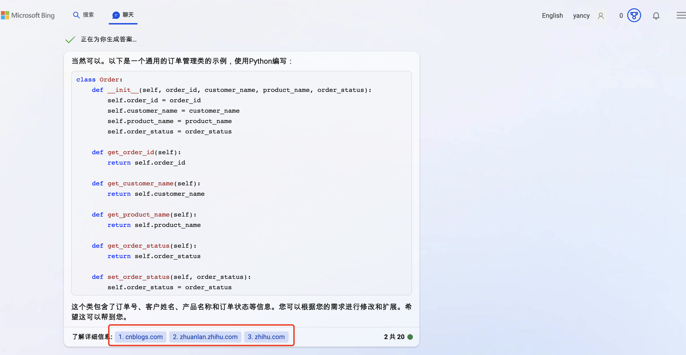

我们可以看到，新版Bing的很多回答底部会有一个【了解详情信息】，并罗列出相关链接。

这表示新版Bing的答案是基于AI解析问题+搜索+AI整合的方式来完成的。而ChatGPT并不依赖于搜索，而是通过大量预训练和微调阶段来生成文本的。这点非常不同。

据说新版Bing集成了GPT4技术，那具体两者有哪些不同？我先问了下NewBing。

所以说，目前ChatGPT限制增强的情况下，使用新版Bing是不错的选择，毕竟新Bing也集成了GPT-4的技术。

#### 新版Bing完整使用教程
1. 前提

仍需要先解决“网络问题”（老规矩，此问题自行解决，请勿讨论任何此类话题）

2. 下载官方指定浏览器 Microsoft Edge

下载地址：https://www.microsoft.com/en-us/edge/download?form=MA13FJ&exp=e533

建议下载最新版本，Edge Dev版，这个版本能包含了Edge浏览器的最新特性。

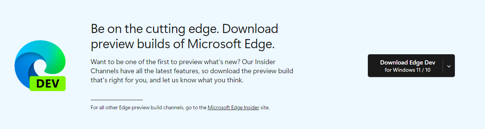

3. 打开官网

安装好Edge浏览器，打开并访问网址：https://www.bing.com/new 会进入如下页面

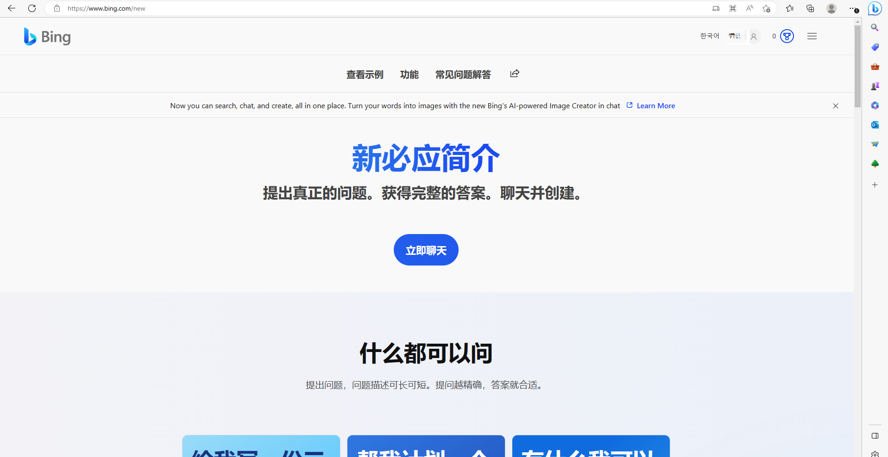

备注：如果网络问题没搞定，打开网址后，会自动跳回国内网址 cn.bing.com

4. 登录你的微软账号

点击上图右上角图标，登录你的微软账号即可。

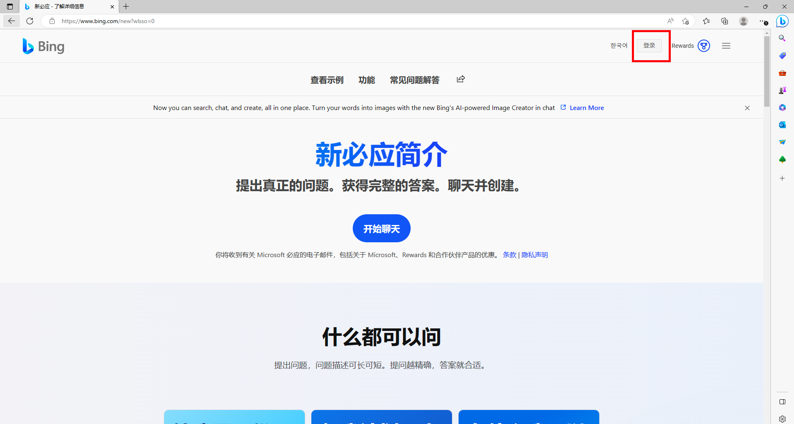

5. 开始聊天

登录成功后，点击“立即聊天”

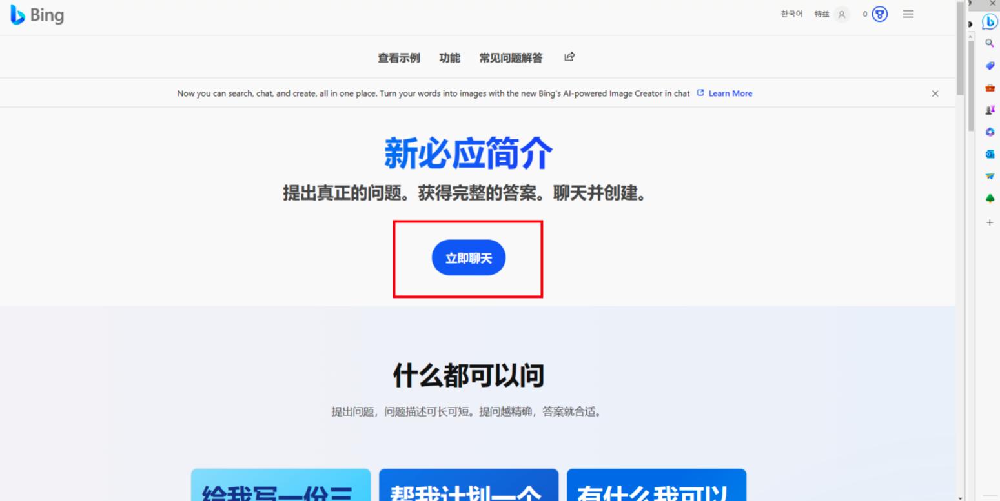

之后页面会跳转至如下聊天页面，现在，你可以开始和新版Bing聊天了。

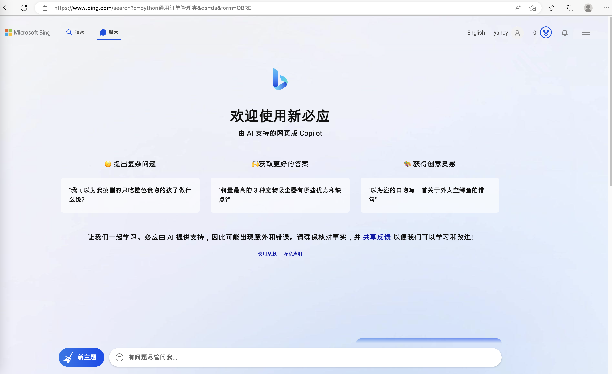

#### 常见问题以及解决方案
1. 新版Bing页面打不开，输入www.bing.com/new 直接跳回到国内版Bing，类似下图：

解决办法：这是“网络问题”，目前新版Bing访问入口并未向国内开放，要看到新版页面，请先自行解决网络问题。

2. 可以打开新版Bing页面，但是点击“立刻聊天”出现报错提示，类似下图：

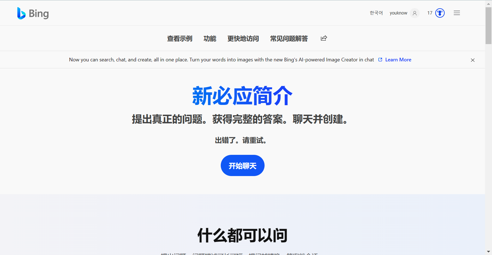

解决办法：

方案1：注册新的微软账号重新登录

有可能是账号问题。我们做过测试，同样网络情况下，新注册账号可以直接开始聊天，老帐号则提示“出错了，请重试”

PS：新注册的微软账号，支持国内邮箱和手机号，亲测有效。

方案2：如果1不行，那请尝试切换你的工具节点，不断尝试即可。

暂时用不了ChatGPT的小伙伴，可以先试试新版Bing。

> 这次封号来势汹汹，很多人的账号刚到手就被封了，同时ChatGPT账号已经不能注册，所以我们需要更多的平替方案。
> 为了让更多人第一时间了解到关于ChatGPT的前沿资讯，我建立了星球【程序员实验室】，BAT大佬亲自下场，教你如何从认识AI到用它变现，进来就送python就业全套大礼包，星球栏目包括【认知篇】、【技术篇】、【基础篇】、【体验篇】、【面试篇】五个模块，满足你的所有需求。
> 不定时邀请资深BAT架构师嘉宾来解答大家的问题，阶梯式涨价，先到就是赚到！

资料包：
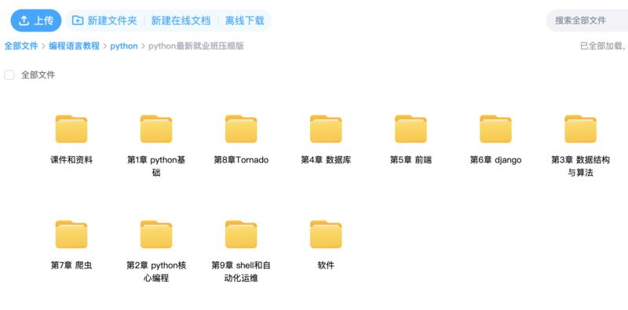

星球部分内容：
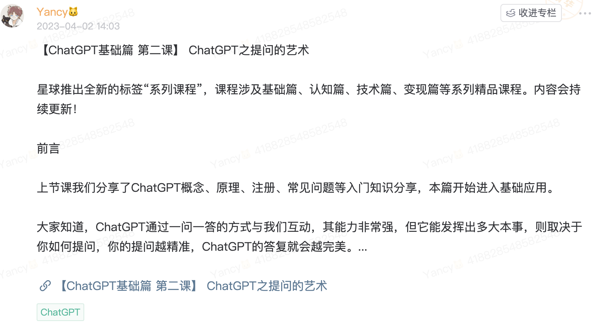
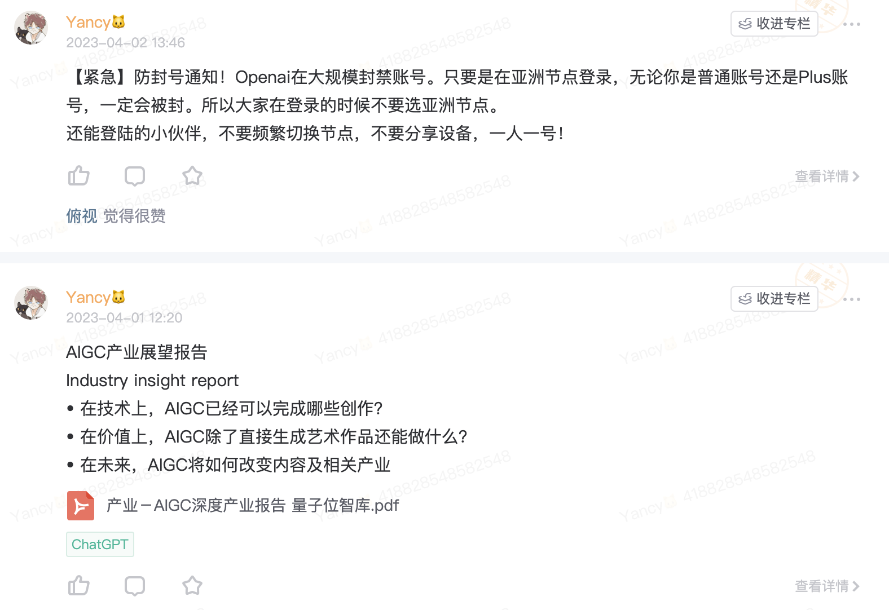
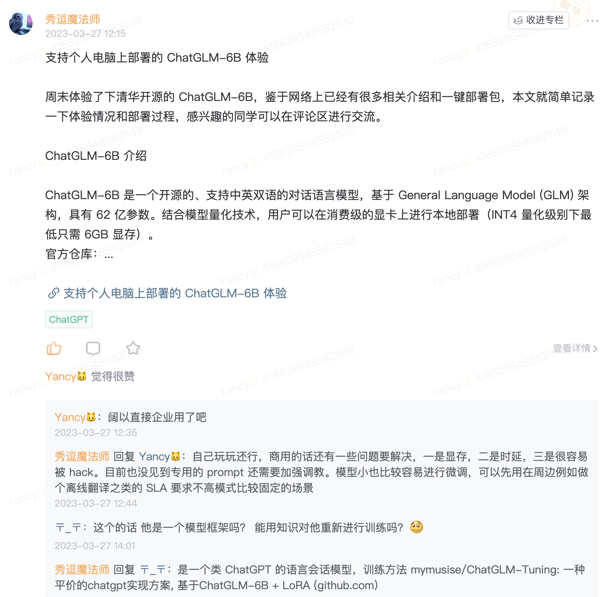
星球内部部分资料截图：
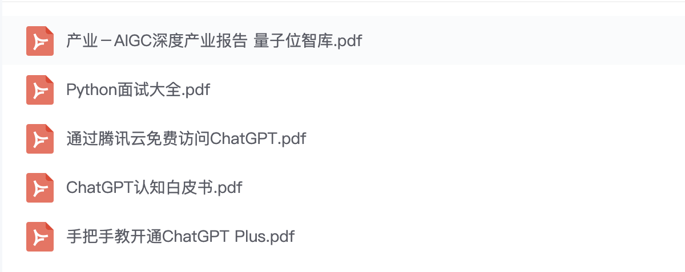

* 我们的优势是:三天内可退款，不过度吹捧技术本身，不夸大技术制造恐慌去割韭菜！！！全是干货，手把手教你怎么做，每天只要2毛钱，就可以得到超多的福利和资源，我们这里不仅有技术大佬，也有商业大神，带你技术层面，商业层面双突破！

* 前10名还有超值优惠券，数量有限，加下面二维码速速领取！

### 必看

- 【程序员实验室】将提供以下服务:

   > 认知方面:普通程序员如何利用技术变现。
   > 知识技能方面:
    1. 后端开发原创知识库，海量学习资料。
    2. 关于python编程语言特性的知识分享以及前沿资讯。
    3. 编程圈最近流行的工具以及使用方法，包含但不限于ChatGPT。
  

- 🚀 不定时分享干货，有兴趣的可以关注公众号。

