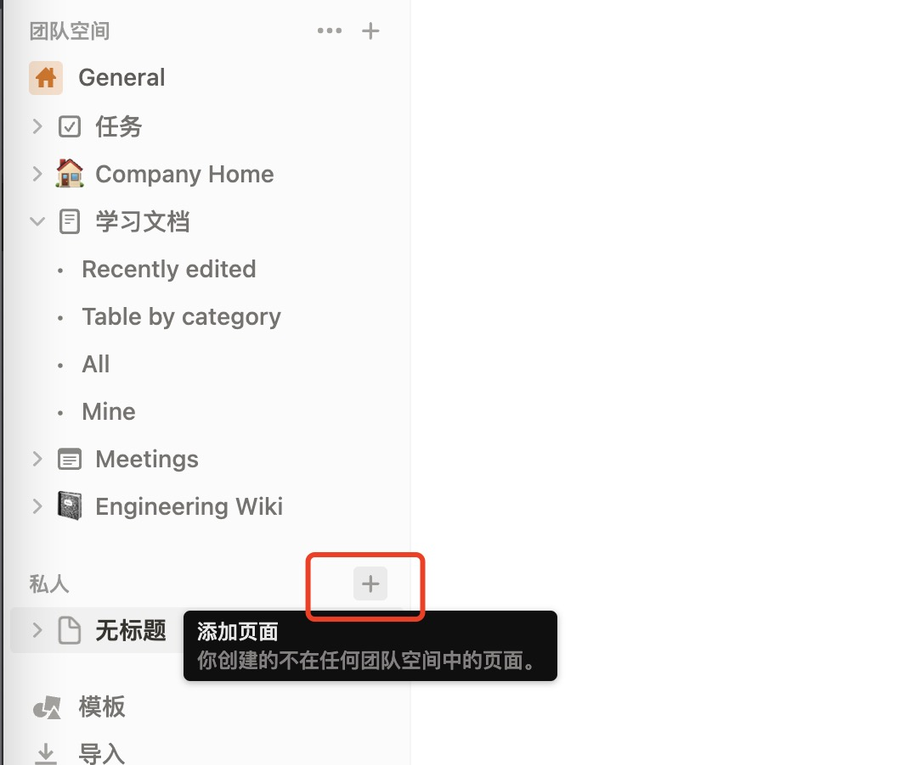
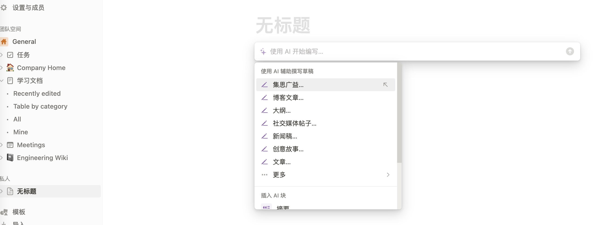
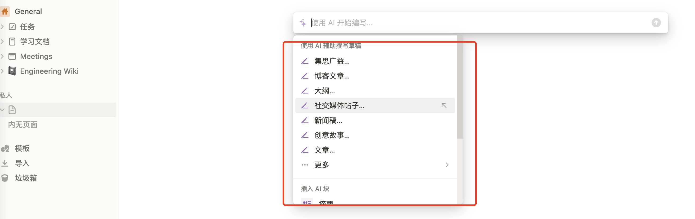
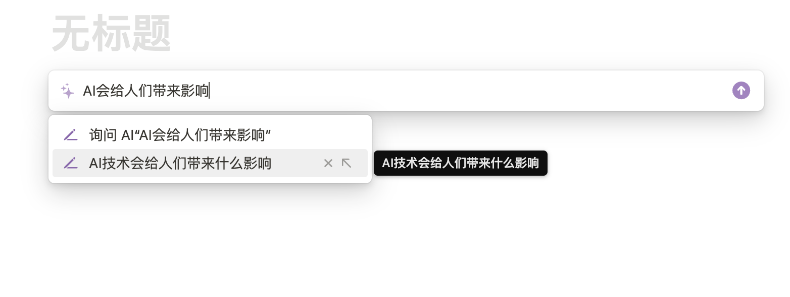
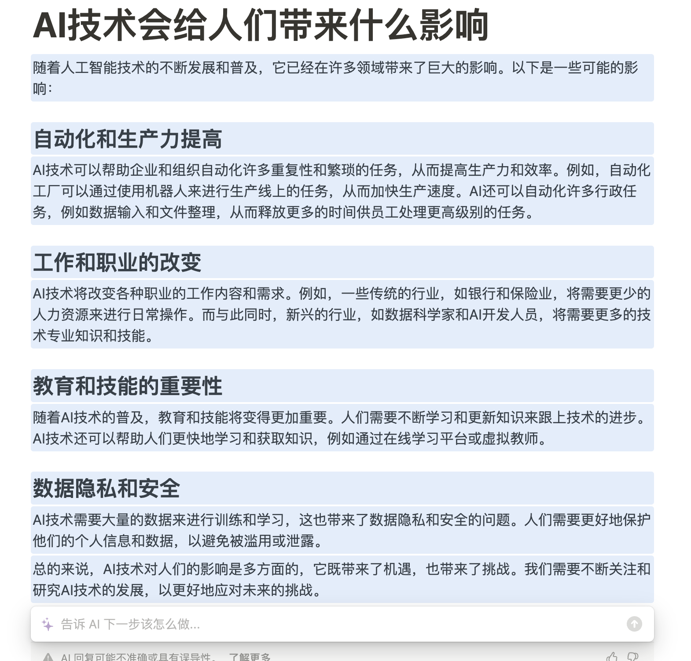
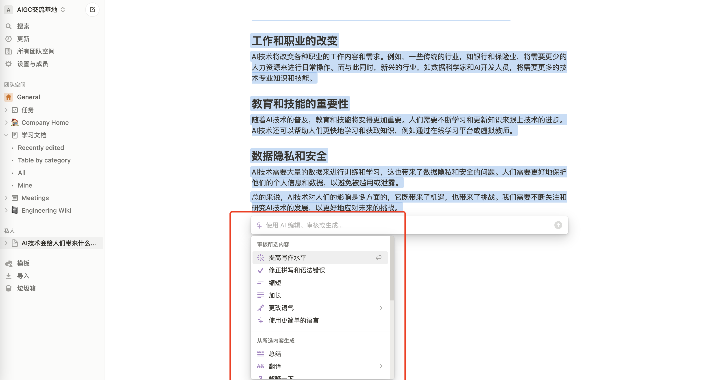

Notion AI 简介&使用快速指南

Notion AI 是 Notion 在2023年2月推出的一项功能，它内置于 Notion 中，不能单独使用。

Notion AI 利用大规模的语言模型和数据收集，能帮助用户自动整理笔记、改正错别字、列出文章重点、翻译、制作表格等。如果你是学生，使用 Notion 搭配 Notion AI 来整理、制作学习笔记可以提高准确性和易读性；如果你是上班族，通过 Notion AI 更可以快速地生成例如讨论大纲、会议行程，甚至是报告的内容。

而且 Notion AI 的执行速度很快，写出来的内容也可以条列式或是表格化，可以大大简化工作流程。

如何申请Notion AI？

1. 注册 Notion 帐号
要使用 Notion AI，你必须要有一个 Notion 帐号，你可以通过 Notion 的网站进行注册。

2. 开始汉化（可选）
参考这篇文章 [notion-zh_CN](https://github.com/Reamd7/notion-zh_CN) ，不过多解释。

3. 开始使用 Notion AI
外面的设置根据需要选择，进去notion后，先创建一个私人文档，如下图：

按下空格键，呼出 Notion AI 的对话框。或者是选中某一段文字，然后选择 "Ask AI"。输入斜杠"/",也会呼出 Notion AI 的对话框。

你呼出 Notion AI 之后，你可以选择一些预设的指令，比如：

- 头脑风暴：给你提供选题。

- 帮你写博客、大纲、社交媒体、广告文案、演讲稿、故事、论文等。
我给它一个题目，然后只要点一点鼠标，它就可以帮你生成内容，例如：我让它给我写一篇AI会对人们带来什么影响。

按下回车，让它编写，最后的内容如下：

我用鼠标选择整篇文章，它甚至可以
- 列出文章重点。
- 制作表格。
- 检查错误、提供更好的写法等。

4. 使用案例

总结文章重点：如何阅读一篇又臭又长的文章，去掉其中的大话、空话。你只需要选中内容，然后点击 "Ask AI" 呼出 Notion AI，输入 "列出文章重点" 即可。

撰写大纲：写一个主题为《人工智能是否会取代部分人的工作》的文章，让 Notion AI 帮你列出大纲。

写文章：Notion 本来就是做笔记的，所以它来写文章还会给你把排版都弄好，如上面的文章。

比较产品优缺点：你可以让 Notion AI 列出两个东西的优缺点。

制作表格：对比上面的比较的内容，你可以选中内容，然后让Notion AI 继续写

头脑风暴：可以让 Notion AI 给你出选题，帮助你找到灵感。

学习外语：Notion AI 可以辅助你学习外语。你可以把一整篇英文复制到 Notion，然后让 Notion AI 帮你设计学习步骤，辅助你学习。

检查错误、提供更好的写法：Notion AI 可以帮你检查你的作文有没有错误，并且给你标记出来，还能对其做出改进，使得你的文章更加流畅、易读。

使用完后，我很喜欢。因为对我来讲，Notion AI 是一款非常有用的工具，可以帮助我大大提高写文效率。

- 🚀 不定时分享干货，有兴趣的可以关注公众号。

