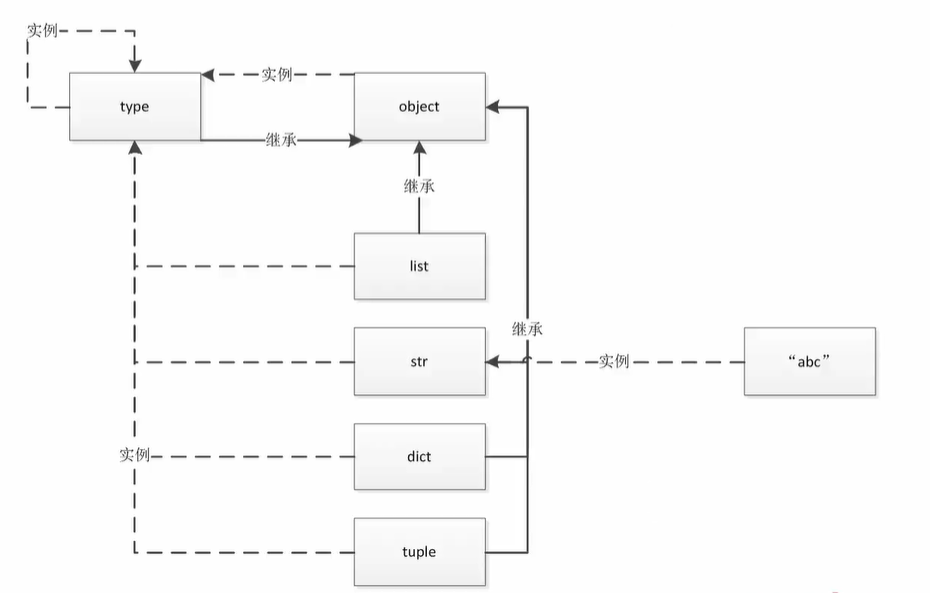

> 本文主要介绍如何用python的魔法函数来实现自定义类，所需基础可参考下面内容。
<kbd>python中万物皆对象实现机制</kbd>
<kbd>实战：python中如何实现自定义序列类型</kbd>

## ✨ 回顾一下之前讲到的python中的万物皆对象的实现机制

> 在python中，函数和类也是对象，属于python的一等公民。这些一等公民也就是对象具有以下几个特性：
- 可以赋值给一个变量
- 可以添加到集合对象中
- 可以作为参数传递给函数
- 可以当做函数的返回值
- 同步就是指一个进程在执行某个请求的时候，若该请求需要一段时间才能返回信息，那么这个进程将会一直等待下去，直到收到返回信息才继续执行下去；



 静态语言中将类加载到内存中运行的时候，类是不可修改的，因为已经编译完成。python为动态语言，全面向对象编程：所有得类都是type的实例，除object来其他类都继承object类，都是可以修改的。


## 🧮 魔法函数贯穿了python的面对对象实现机制
这里就不得不介绍鸭子类型，鸭子类型简单点来说，就是如果你具有鸭子的属性，那你就是鸭子。
比如，鸭子会嘎嘎叫，鸭子会两只脚走路。那么你如果实现了这两个方法，那么就可以说这个类型是鸭子类。
这一点和许多静态语言是相反的，静态语言往往是先定义一个实体，再去描述实体的属性和方法。
鸭子类型的特性是根据魔法函数来实现的，决定了该class可以如何被使用。
> 实战：比如一个可迭代对象底层基于__iter__和__next__的调用，那么我们就可以定义一个类，类中有__iter__和__next__这两个方法，就说明这个类是可迭代对象。

## 🏷️ 魔法函数好处多多
魔法函数是python中的特殊方法，那你可以理解为，这些特殊方法是一些定义好的回调行为，
所以魔法函数不能自定义，定义之后不需要调用，若你将这些行为用到自己的类中，那么当触发这个回调后就会调用这个方法，语法规则为双下划线加方法名称。
如__{FUNC}__，以下函数的双下划线被markdown格式吞了，请自行加上。
###  所有的魔法函数如下：
- ####  __repr__：用于自定义输出实例化对象信息
  - 默认情况下（也即用户不显式写出__repr__方法时）会得到“类名+object at+内存地址”这样格式的信息
  - 当显示写出__repr__方法时，解释器会按照你所定义的格式输出实例对象信息
  - __repr__面向程序员

- #### __str__：用于返回一个对象的描述信息
  - 当使用print输出对象的时候，若定义了__str__(self)方法，打印对象时就会从调用这个方法并
  打印出return的字符串数据
  - __str__面向用户
  - __repr__适用于所有环境中，__str__只是覆盖了__repr__以得到更友好的用户显示


  栗子：
  ```ts
       class Test:
           def __str__():
               return "test"
           
           def __repr__():
               return "TEST_CLASS"
       
       a = Test()
       print(a)

    输出：
    test
   ```
- #### __len__：在Python中，我们经常会使用len()函数获取一个对象的长度，实际上在其内部会自动调用该对象的__len()__方法
  - python内置类型(int list dict)底层均为c语言写的，需要用cython解释器去执行，所以长度在一开始分配内存空间的时候就已经确定了，而不是去遍历，所以用魔法函数的len的效率高
  
  栗子：
  ```ts
    class WordNums():
           def __init__(self, *args):
               self.word = args
           def __len__(self):
               print("调用了__len__方法")
               return len(self.word)
           ret = WordNums('hello', 'world', 'Python', 'encoding')
             print(len(ret))
                 
    输出：
    调用了__len__方法
    4
  ```


- #### __getitem__在被迭代时会传入当前的循环变量然后进行索引

- #### __setitem__： 这个方法应该以与键相关联的方式（类似字典的方式）存储值，以便之后能够使用__setitem__来获取（也即key/value）
- #### __delitem__： 此方法在对象组成部分（对象必须可变）使用del语句时被调用，会删除与key相关联的值
- #### __contains__： 用于判断我们输入的数据是否在类里,这个方法很少用
- #### __iter__, __next__：迭代相关
- #### __call__，__new__，__init__:一般在元类编程中会使用，使用方法可以参考之前的元类编程的文章。
- #### __enter__，__exit__：上下文管理器
- #### __abs__，__bool__，__int__，__float__，__hash__，__index__：数制转换
- #### __getattr__、__setattr__、__getattribute__、__setattribute__、__dir__ 属性相关
- #### __get__,__set__,__delete__:属性描述符
- #### __await__,__aiter__,__anext__,__aenter__,__aexit__:携程相关，我很少用

## ✨补充：

- 上文中提到了魔法函数有些并不是很常用，了解即可，推荐根据功能进行学习而不是根据特定的方法。
- 🚀 不定时分享干货，有兴趣的可以关注我公众号。

<div align="center">
</div>

