更多精彩系列课程


这篇文章主要内容

- ChatGpt如何读取流程图并生成代码
- 如何利用chatgpt辅助你加速ChatGpt API

> 想必大家都在尝试ChatGpt接入并赋能自己的各大应用和场景，比如接入微信机器人自动回复消息，又或者接入公众号

当然作为技术人员我也尝试了下并成功变现，结果如下：


有兴趣的可以读我之前的文章

我们可以看到，虽然功能完美完成，但是速度却依然有瑕疵（此视频加速了3倍）。


#### 为什么这API么慢

我总结了以下四点，供大家参考

1. 网络延迟： ChatGPT API 是云服务，需要在互联网上通过网络连接访问。如果您的网络连接速度较慢，则会导致 API 请求响应时间变慢。

2. 请求量：ChatGPT API是高度可扩展的，但如果同时向API发送大量的请求，API的响应时间可能会变慢。此时您可以考虑使用异步请求或者批量请求。

3. API负载：当很多用户同时请求 ChatGPT API 时，API的负载会增加，可能会导致响应速度变慢。为了缓解这种情况，API提供了“请求配额”限制每个用户请求的次数，以避免过度使用。

4. 模型复杂性： ChatGPT API 使用基于深度学习的语言模型来生成文本。这些模型非常复杂，需要大量计算资源和时间来执行。在一些极端情况下，如果请求的文本长度非常长，或者API正在处理大量的并发请求，响应时间可能会更长。

#### 如何优化

为了优化使用 ChatGPT API 的响应速度，我们可以尝试以下方法：

1. 使用异步请求：异步请求可以将请求发送到 API 后立即返回响应，而不必等待 API 完全处理请求。这可以大大减少响应时间，特别是当您需要处理大量请求时。

2. 限制请求量：如果您的应用程序需要大量使用 ChatGPT API，可以考虑限制请求的数量，以避免过度使用 API。

3. 优化请求数据：减少发送到 API 的数据量可以减少响应时间。您可以尝试缩短请求的文本长度或优化请求参数。

4. 尝试使用更强大的硬件： ChatGPT API 运行在高性能计算机上，如果您的应用程序需要处理大量请求或需要更快的响应时间，可以考虑使用更强大的硬件。

这几种方法，我们可以结合自己现有的业务去选择多个，往往一个是解决不了所有的问题。就比如，我如果限制了API的请求数量，
那势必我API的并发量就会降低，这时可能需要申请多个APIKEY去处理并发问题，这里可能又会出现，多个APIKEY在同个ip地址使用多次可能会被封禁的问题。

看到了吗，问题一个接一个，我们得结合具体业务去选择。
我先给大家解释一下常用的几种加速方法具体使用流程以及具体应用实例，方便大家理解
1. 网络中转：解决网络延时问题
常用的方法有：
 - 选择合适的T子，这块请勿在星球讨论，免费的和便宜的一般速度会很慢也不稳定，频繁切换节点很容易造成账号被封。
 - 腾讯云云函数中转，即代理服务器为腾讯云服务器。详细教程在星球的进阶课程中：
 - 其他第三方服务器中转，具体参考：https://github.com/x-dr/chatgptProxyAPI
 - 自己购买服务器中转，比如买一台国外的服务器，在上面创建一套转接服务，不过成本和对技术要求比较高。
我这里就不一一介绍了，原理还是比较简单的，目前测试起来，腾讯云云函数比较不稳定，大家没有合适的T子的情况下可以试试第三方服务中转，有反馈nextjs的比较稳。
 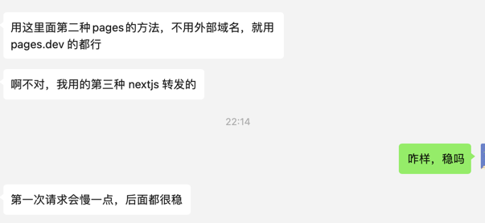

2. 异步请求：解决网络延时问题
美人鱼流程图脚本：
```text
graph TD
A[开发者服务器] -->|立即返回| API(API服务/接口)
A -->|注册api请求事件到队列中|TASK(处理消息队列的异步服务)
TASK --> |调用api接口|API_SERVICE(chatgpt api云服务)
API_SERVICE --> |返回|TASK
TASK --> |返回API请求|CLIENT

CLIENT[客户端] -->|请求| A

```
美人鱼流程图如下（语法教程可参考：https://blog.csdn.net/kl28978113/article/details/93616584）：

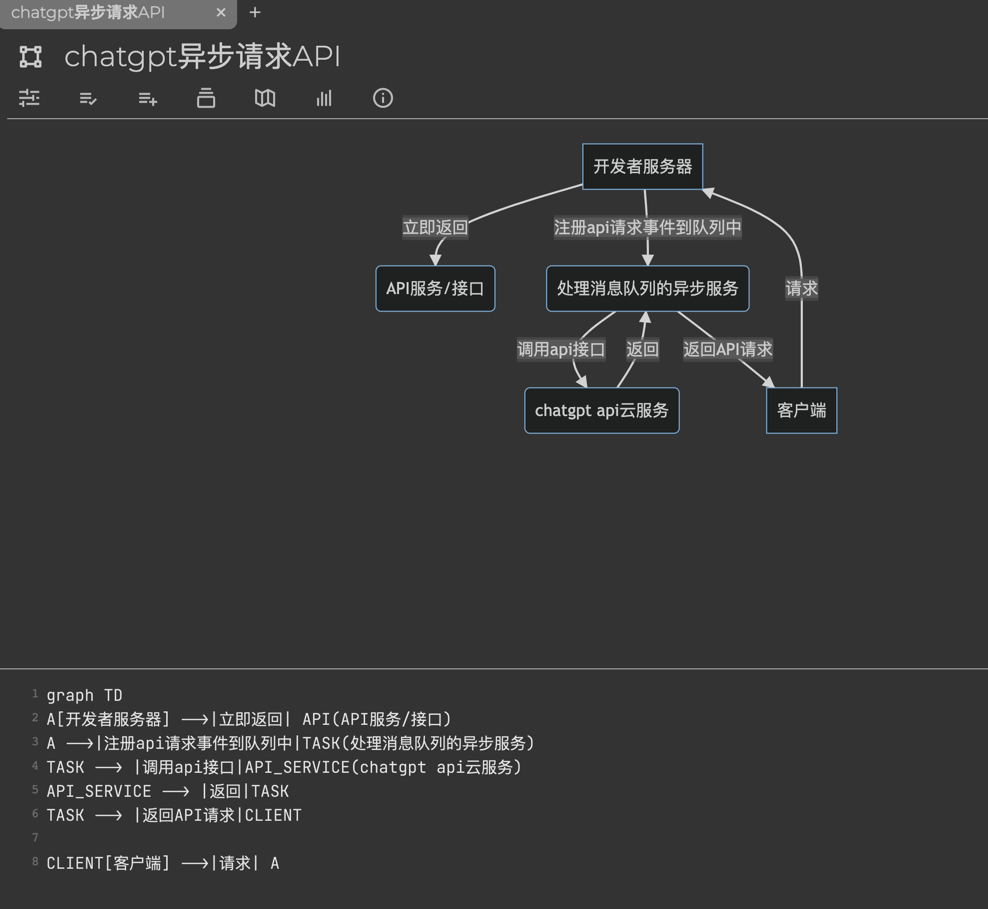

这样的好处不仅是减少了客户端等待的时间，更重要的是可以解耦业务逻辑和ChatGpt API服务之间的关系。之后如果API有速度性能瓶颈可直接横向扩展消息队列层，
业务逻辑不受影响,这样可以多维度解决速度问题。

我们就用这个例子测试一下chatgpt写代码的能力！
首先我们要让Chatgpt可以读懂你的流程图。
我们先问问ChatGpt能不能读取美人鱼流程图文件，答案如下：
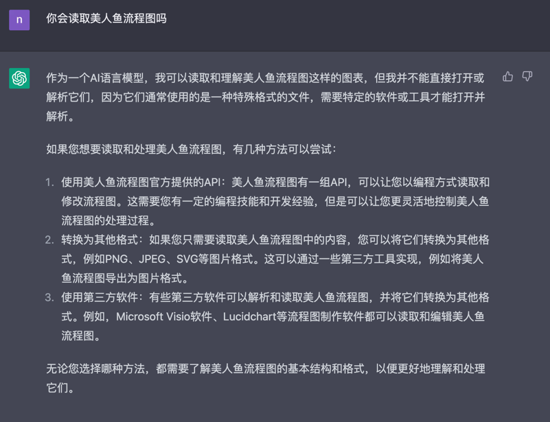
我们直接把流程图脚本粘贴给它，看它能不能生成代码
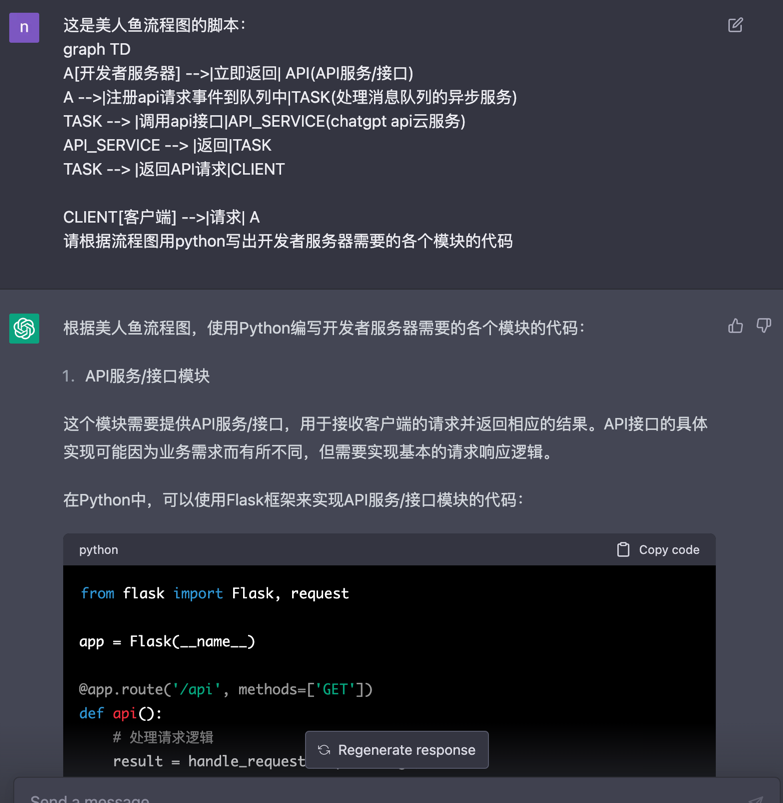
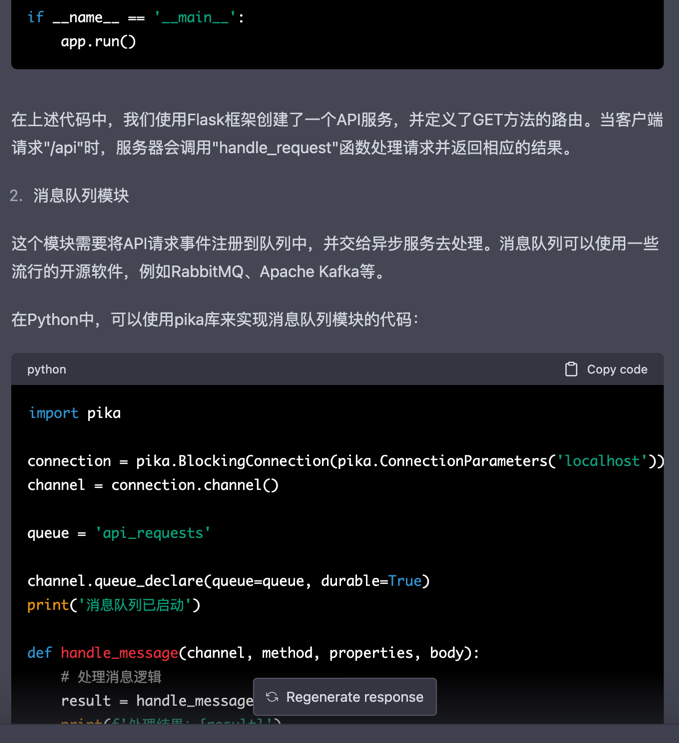
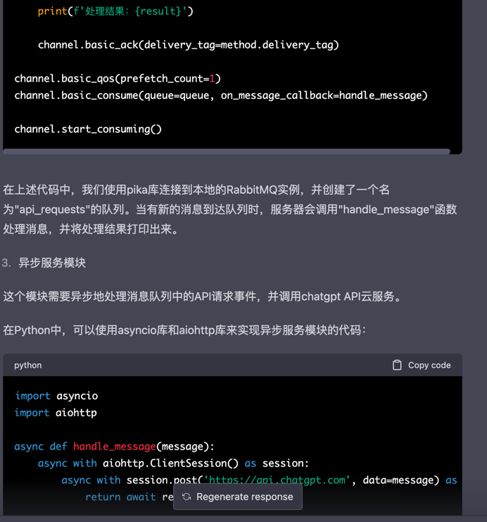
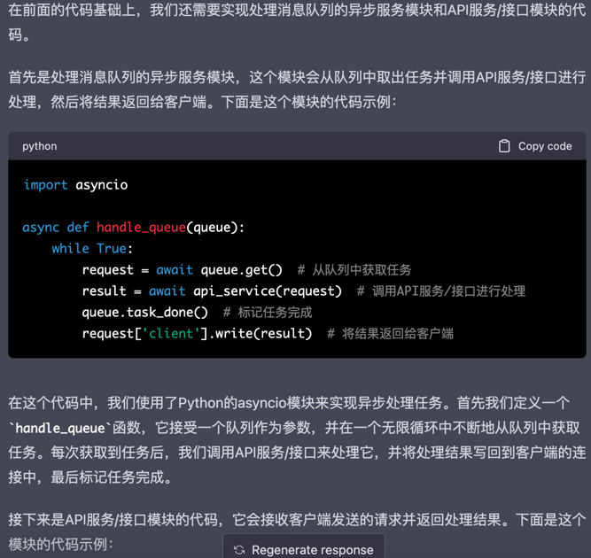
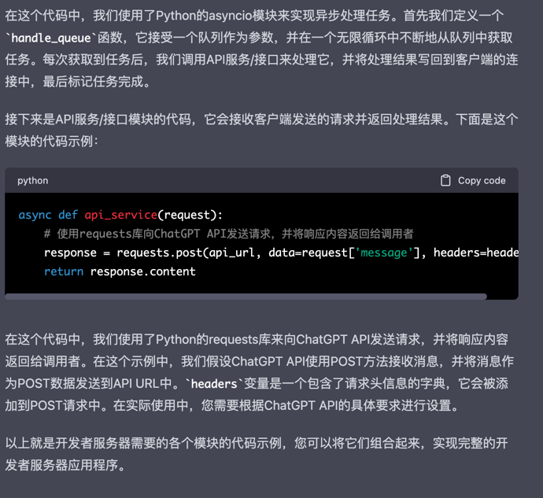

看起来还不错，理解了我们模块直接的关系，但是拆分的太散，我们试下让chatgpt将它合起来
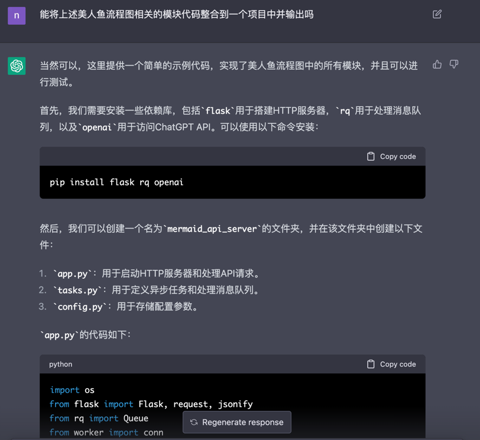
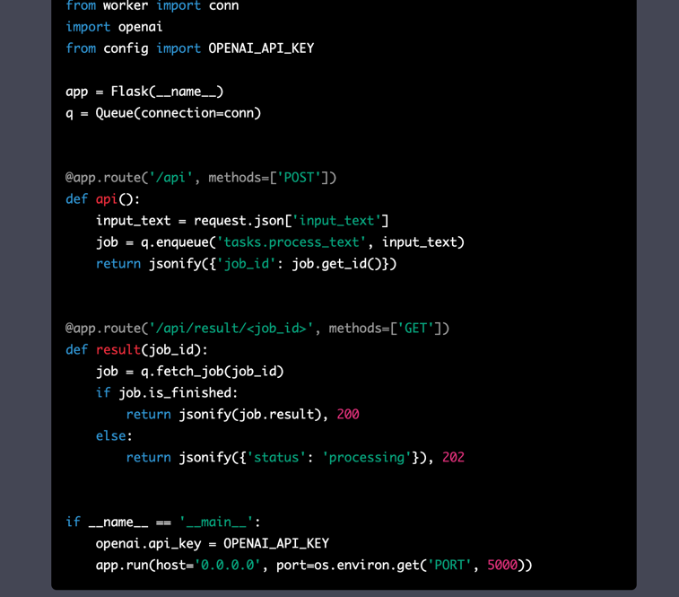
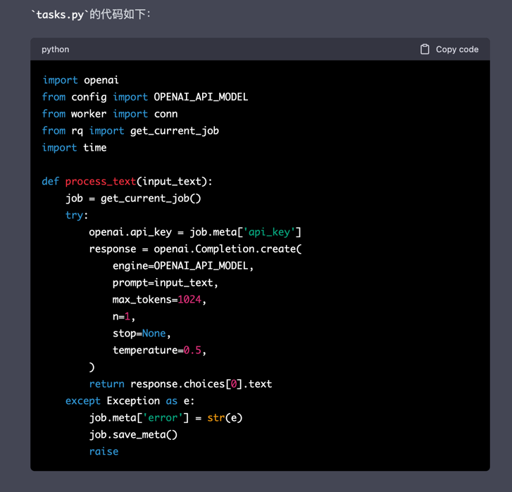
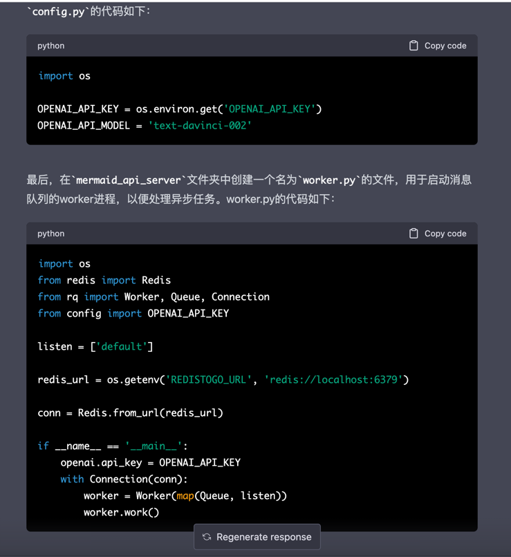

当这里我已经相当满意了，它甚至还要帮你写测试用例

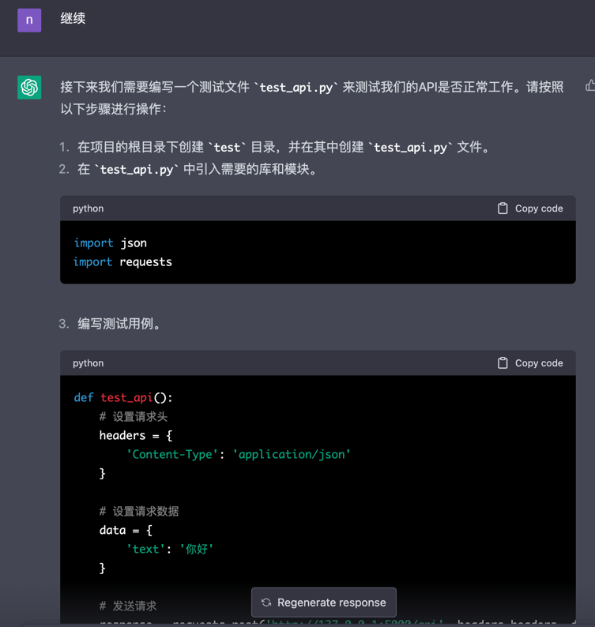
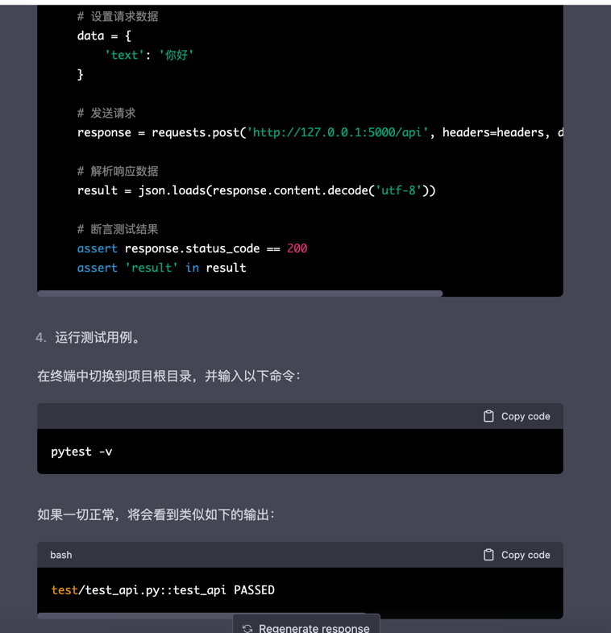

也就是说，我们画出足够详细的流程图，并将流程详细的告诉它，它完全可以帮我们生成系统代码。
这和我们上节课讲的生成视频有异曲同工之妙，就是你的指令越清晰越明确，那么最终的结果就越准确。
我把美人鱼流程图脚本贴在这里，大家空了可以去试试。之所以是用美人鱼流程图，是因为这个流程图的脚本更加方便chatgpt文本阅读，从而让它理解每个模块的关系，
如果我搞张图片去让它理解，就有点太为难一个文本聊天模型了。

应用例子：我的公众号接入了ChatGpt速度很慢，公众号又有一个限制，就是自动回复的响应超过了5s就会报服务错误，
用异步的方法，就可以解决这个问题，每次请求过来我都不请求ChatGPT然后立即返回，将请求先放队列中，异步处理通过自动发消息给用户的接口回复给用户（只有企业认证的公众号才有发消息给用户的接口，这点需要注意）。


3. 流式读取返回数据：解决返回数据量大的问题

现在巨多企业在用流式读取解决应用交互问题，大家一定要了解，当我们使用ChatGPT API来生成文本时，API的响应数据可能非常大，这可能会导致应用程序在处理响应时出现延迟或内存问题。为了解决这个问题，我们可以使用流式读取来逐块处理API响应数据，这可以提高应用程序的响应速度，同时减少内存使用。

流式读取的工作原理是，它允许我们在响应数据到达之前逐步处理响应。这意味着我们可以在数据到达之前逐步处理响应，而不是等待所有数据都可用之后再处理它。在这种情况下，我们可以使用HTTP分块编码，将响应数据分成多个块发送，而不是将整个响应数据一次性发送回给应用程序。

代码可直接询问chatgpt获取： 将流式读取chatgpt api的前端后端代码都写出来
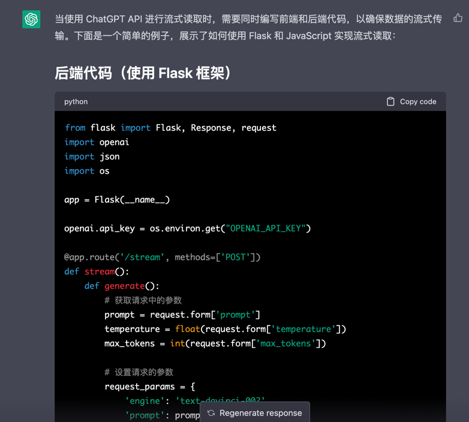
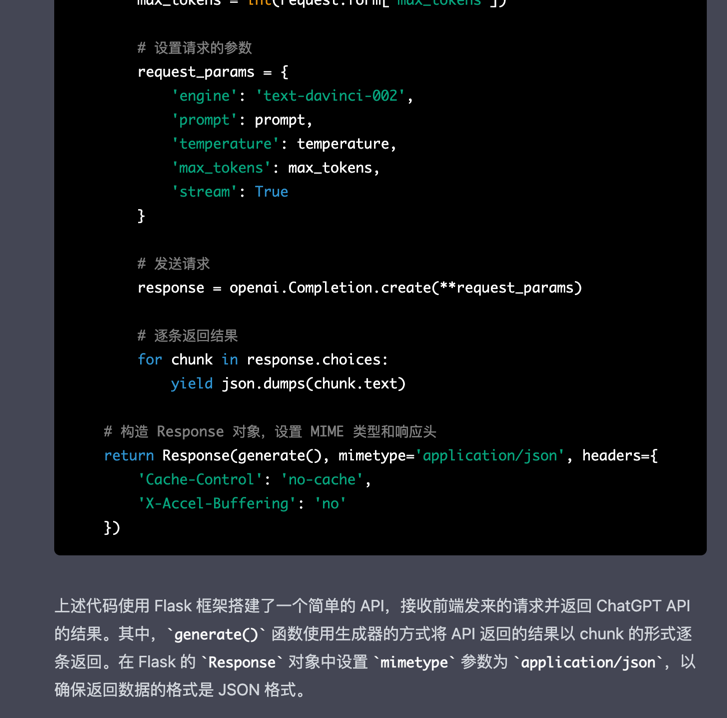
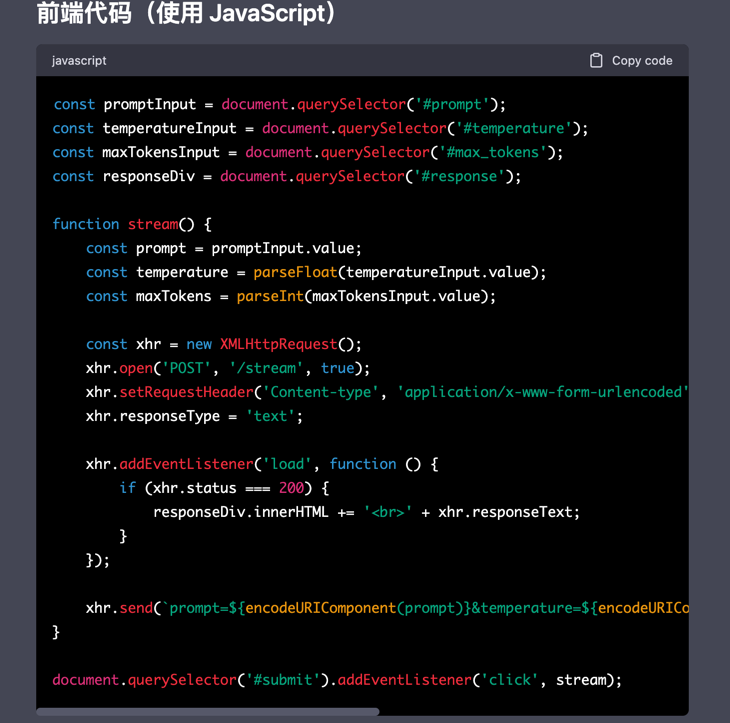
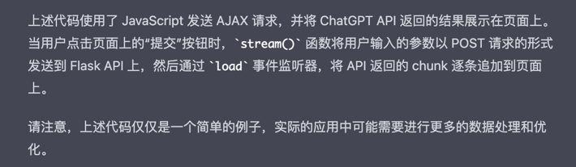

确实还写出来了，用到了迭代器生成器，代码质量还是挺高的。但是这种方式也明显有弊端，就是依赖前端的读取数据的方式，如果客户端不支持流失读取，那么也无法使用，
比如将ChatGpt接入到各大第三方平台，因为第三方平台的客户端都不是流失读取的，所以用这种方式就行不通了。

好了，这次的分享就到这里了，大家有问题可以在星球内部提问～

对你有帮助的话别忘了点个赞呀～

我的星球【程序员实验室】目前定价169元，早鸟价69元，随着人数的增长阶梯式涨价！

估计早加入到小伙伴，都乐开花了。 因为星球有众多前沿资料，分享 ChatGPT 用于创新赚钱的最新机会

我估计看了分享的小伙伴，直接就觉得值回门票了，因为可复制性太强了，直接学了就可以拿来用。
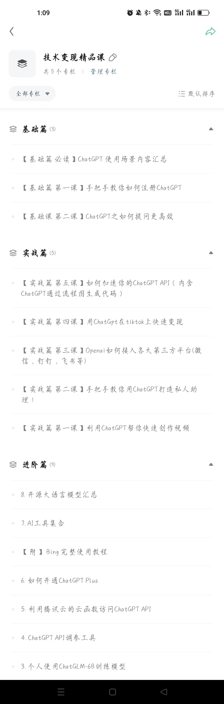
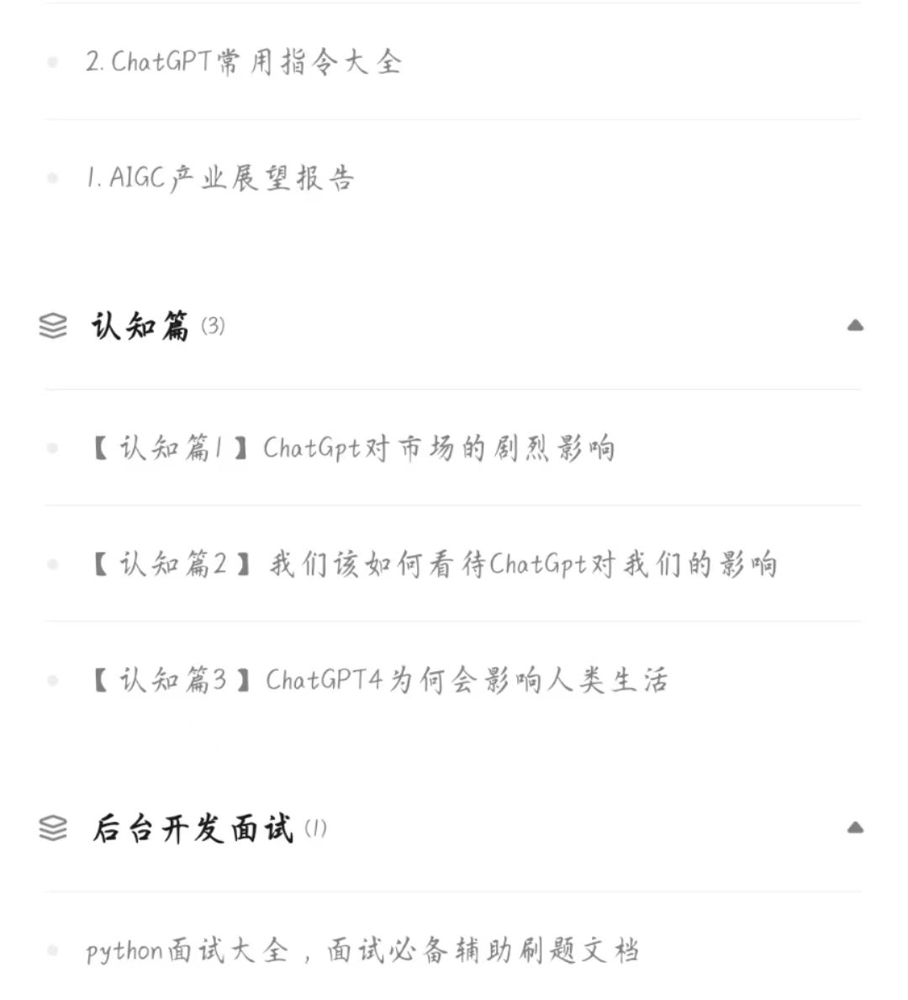

* 我们的优势是:
* 三天内可退款，不过度吹捧技术本身，不夸大技术制造恐慌去割韭菜！！！
* 全是干货，手把手教你怎么做，学了就可以拿来用，每天只要2毛钱，进来就送价值899元的python就业班全套课程+ChatGpt教程！
* 我们这里不仅有技术大佬，也有商业大神，带你技术层面，商业层面双突破！


