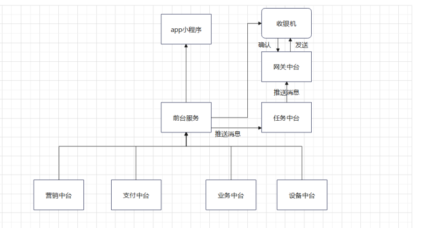

订餐中台服务设计

## 🖼️ 1. 总体设计

### 1.1 软件描述
  摒弃大单体设计结构，将系统业务按照功能拆分为更加细粒度的服务，所拆分的每一个服务都是一个独立的应用，这些应用对外提供公共的API，可以独立承担对外服务的职责，通过此种思想方式所开发的软件更容易维护，并且可满足较为长远的横向拓展性。

### 1.2 设计方法

#### 软件结合微服务三大特性：单一职责,高内聚 ,低耦合
#### 具体实现方法为： 
##### 1. 隐藏内部实现，中台服务不对外实现，只提供给外部sdk供其访问。
##### 2. 避免数据共享，不同中台服务之间代码不相互引用，不使用同一个数据库。
##### 3. 避免数据过度暴露，数据定义摒弃传统的json结构变为protobuf序列化，有效增加传输的速度。
##### 4. 最小化硬件共享，利用k8s镜像部署服务，容器之间相互隔离，硬件资源单独限制。

### 1.3 软件结构

#### 1. 订餐中台服务基于python的flask后台web框架，只用来提供公共抽象实体的操作服务，前台服务用于业务层聚合各种实体。
#### 2. 与收银机的通信采取socketio连接，为了解决分布式容器服务寻不到址的痛点，引入微服务运行时dapr的actor模型。
#### 3. 分层设计，结构图如下

## 📚 2. 模块设计说明

### 2.1 支付中台服务
- 用来提供通过第三方支付的公共服务,存储进件信息，可操作微信支付宝第三方支付，存储第三方支付进件信息供业务服务调用。实体结构定义图

### 2.2 设备中台服务
用来提供通过操作第三方硬件设备的公共服务，可直接操作收银机，音响，打印机等外部设备的服务

### 2.3 业务中台服务
用来提供业务的公共服务，操作商品实体，订单实体，商户基础信息等基本的业务实体

### 2.4 任务中台服务
- 用来处理各种消息推送和任务的服务，用于处理和推送消息。

### 2.5 网关
- 用来和收银机端连接通信，与任务中台产生交互。

### 2.6 前台服务
- 根据业务聚合以上各种实体的业务层，与任务中台产生交互。

## 🚀 3.与客户端交互

- 收银系统基于tcp的长连接实现消息推送，也就是服务器消息可以及时的下发到收银机系统。例如，餐饮收银使用扫码点单，需要将订单推送到收银机进行订单出单。消息推送模块包括：商品、产品更新、沽清、上架、接单、打印等。
推送服务器需处理如下：
1. 建立长链接服务端，支持与客户端建立长链接，并对客户端进行管理；
2. 建立web服务器，提供客户端和服务端需要的相关数据接口。
接口包括： 设备注册接口、推送消息接口、设备是否在线等。
3. 服务端要对长链接感知到并进行业务处理，解决分布式服务的寻址问题。

## 📝 4.代码规范
### 4.1.代码层级

- 开放接口层：可直接封装 Service 方法暴露成 RPC 接口;通过 Web 封装成 http 接口;进行 网关安全控制、流量控制等。
- 终端显示层：各个端的模板渲染并执行显示的层。当前主要是 velocity 渲染，JS 渲染， JSP 渲染，移动端展示等。
- Web 层：主要是对访问控制进行转发，各类基本参数校验，或者不复用的业务简单处理等。
- Service 相对具体的业务逻辑服务层。
- Manager 通用业务处理层：它有如下特征:
  1. 对第三方平台封装的层，预处理返回结果及转化异常信息;
  2. 对Service层通用能力的下沉，如缓存方案、中间件通用处理;
  3. 与DAO层交互，对多个DAO的组合复用。
- DAO 层：数据访问层，与底层 mongodb 进行数据交互。

### 4.2.分层模型

- 为了避免过多的数据转换，采用一个折中方案。

1. 允许Service/Manager可以操作数据领域模型，对于这个层级来说，本来自己做的工作也是做的是业务逻辑处理和数据组装。 
2. Controller/TService层的领域模型不允许传入DAO层，这样就不符合职责划分了。 
3. 同理，不允许DAO层的数据传入到Controller/TService。