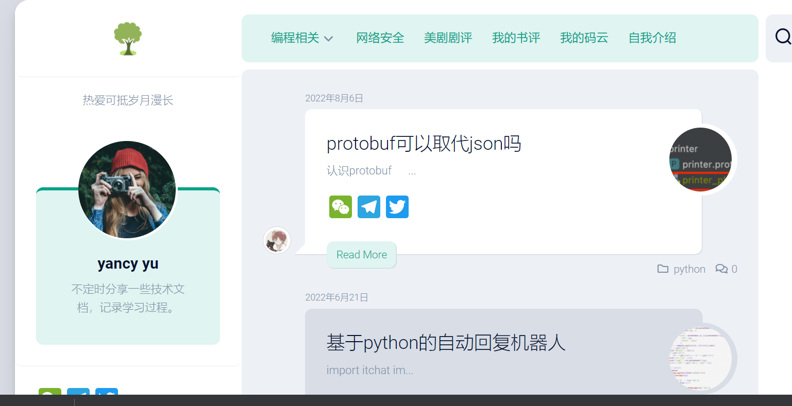

### 1. [博客框架QWER](https://docs-svelte-qwer.vercel.app/)

>支持markdown文件格式，十分简单好用。无需关注前端样式，通过直接在项目文件夹添加文件即可发布文章，并可快速部署，具体可点击上方链接。
> 实例如下图：[示例链接](https://blog-yancyuu.vercel.app/)

### 2. [博客框架wordpress](https://cn.wordpress.org/)

> WordPress是使用PHP语言开发的博客平台，用户可以在支持PHP和MySQL数据库的服务器上架设属于自己的网站。也可以把 WordPress当作一个内容管理系统（CMS）来使用。
> 实例如下图：[示例链接](https://www.yancyyu.club/blog/)

- 🚀 不定时分享干货，有兴趣的可以关注我公众号。

