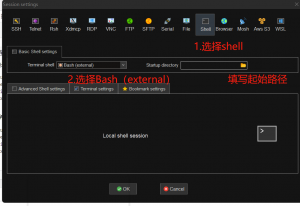

## 1. [Tabby](https://github.com/Eugeny/tabby/releases)

>用了Tabby，我果断抛弃了MobaXterm，因为它实在是太太太好看了。 工欲善其事必先利其器，
> 用到它之后开发效率也可以大大增加，支持分屏，可自定义终端连接，能满足开发者大部分需求。

### 界面如下图：风格和win11好搭，颜控爱了

### 简单介绍下常用功能
#### 👷 SSH连接

点击首页的 『Settings』进入设置页面，在 『Profiles & connections』中点击 『+ New profile』：
选择 SSH 连接：
填写 SSH 连接信息，完成后点击『Save』进行保存：
可以看到 SSH 连接已添加成功，点击按钮进行连接：
然后就可以进入命令行进行使用了

#### 📁 SFTP传输文件
点击终端上方的 SFTP 按钮，点击右上角upload按钮，可在本地选择想要上传的文件进行上传：
但是，想要下载文件比较难办。
外观选择
『Color scheme』可以选择配色。
『Window』界面修改其他显示设置。
『Plugins』可以安装其他插件。

#### 🏷️ 快捷键
点击首页的 『Settings』进入设置页面,点击hotkeys就可以设置好多快捷键啦
我这里常用的是分屏，设置分屏参数示例如下图:

## 2. [MobaXterm](https://mobaxterm.mobatek.net/)

> MobaXterm 向 Windows 桌面提供所有重要的远程网络工具（SSH，X11，RDP，VNC，FTP，MOSH 等）和 Unix 命令（bash，ls，cat，sed，grep，awk，rsync 等），可直接使用。有关支持的网络协议的更多信息
使用多合一网络应用程序执行远程任务有很多优点，例如，当您使用 SSH 连接到远程服务器时，图形 SFTP 浏览器将自动弹出以直接编辑您的远程文件。您的远程应用程序还将使用嵌入式 X 服务器在 Windows 桌面上无缝显示。

### 在这里简述几种用途，其余的请自行谷歌。

#### 👷 内部连接gitbash终端

- Session->newSession,Session settings -> Shell ->Terminal shell 选择 Bash

- 修改新建的那个Session属性：Session settings -> Advanced Shell settings -> Distribution 输入git安装路径,如下图- Session settings -> Advanced Shell settings -> Execute the following commands at startup 输入 "C:\Program Files\Git\bin\sh.exe" --login

- Session settings ->Termina settings -> Use Windows PATH

> tips:因为之前我在gitbash的初始化加载文件~/.bash_profile中增加了很多自定义shell语句，这里不会自动应用，需要source一下，如下图

🚀 不定时分享干货以及开源工具，有兴趣的可以关注我公众号。

